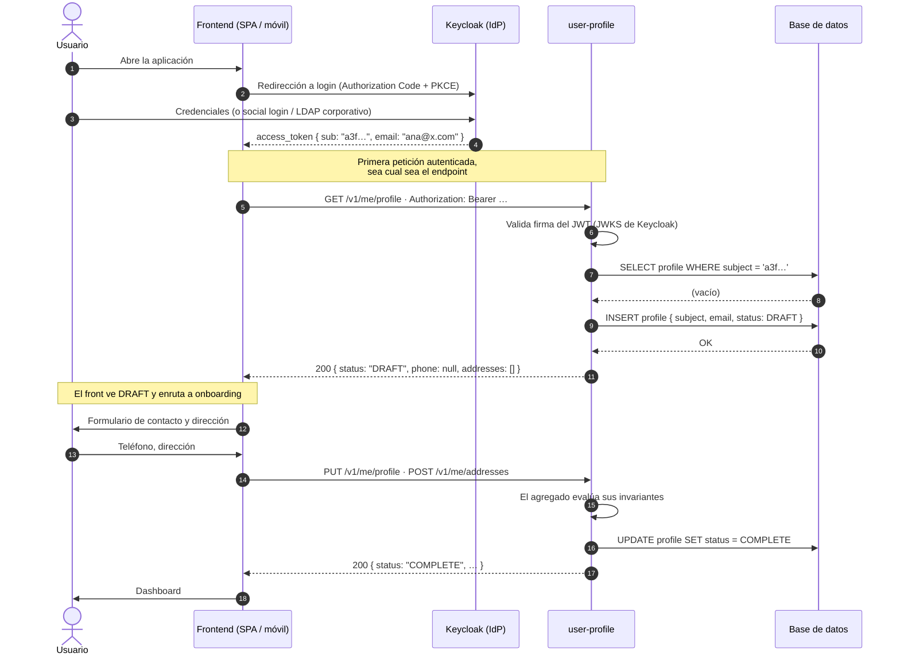
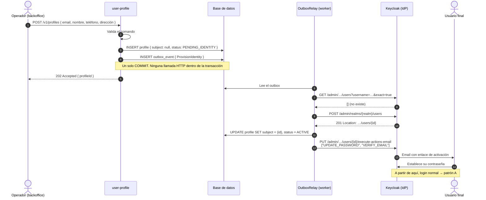

# Perfil de usuario y servidor de autenticación: quién guarda qué y cómo se enganchan

**Respuesta corta:** hay **un solo dueño de la identidad** —el servidor de autenticación (Keycloak)— y **un solo dueño del perfil** —tu servicio `user-profile`—. Nunca los dos a la vez sobre el mismo dato.

- El IdP posee lo que sirve para **entrar**: credenciales, MFA, sesiones, roles, el identificador.
- Tu servicio posee lo que sirve para **operar**: dirección, teléfono, datos de contacto, preferencias, estado de negocio.
- La costura entre ambos es **un único campo**: el `sub` del token, que es la clave primaria de tu agregado.

Los ejemplos usan Keycloak, pero el patrón es del problema y no del producto: la §10 lo traduce a Cognito, Auth0 y Entra ID, donde solo cambian los mecanismos.

Y el sesgo de partida, que conviene declarar ya: **el usuario nace en el IdP, no en tu servicio**. Tu servicio *adopta* identidades, no las crea. Aprovisionar en esa dirección elimina de golpe la consistencia distribuida; hacerlo al revés la introduce, y entonces hace falta todo el aparato de la §7.

---

## 1. Por qué esta decisión confunde

Porque el IdP **parece que ya lo hace**. Keycloak tiene un *declarative user profile*: puedes declarar atributos con validaciones, permisos de lectura y escritura por rol, campos multivaluados y hasta agruparlos para la UI.

```json
{
  "unmanagedAttributePolicy": "DISABLED",
  "attributes": [
    {
      "name": "phone",
      "displayName": "Teléfono",
      "permissions": { "view": ["admin", "user"], "edit": ["user"] },
      "validations": { "length": { "max": 20 } }
    }
  ]
}
```

Y encima OIDC define un claim estándar `address`. Así que la conclusión aparente es: *ya tengo dónde guardar la dirección, ¿para qué un servicio?*

La trampa está en que eso resuelve el **almacenamiento** y no resuelve nada más. Un IdP es un almacén clave→valor(es) por usuario, con validación de **formato**. Lo que necesitas para un perfil real es otra cosa:

| Lo que necesitas | Lo que da el IdP |
|---|---|
| Objetos compuestos y colecciones (N direcciones con etiqueta, vigencia, "cuál es la de envío") | Pares clave→valor planos. Lo acabas serializando en JSON dentro de un atributo |
| Invariantes de negocio ("no puedes borrar la dirección de envío si hay un pedido en curso") | Validación de formato: longitud, patrón, email |
| Consultar, filtrar, paginar, hacer join | La Admin REST API: sin joins, una llamada HTTP por consulta |
| Transaccionalidad con el resto de tus datos | Nada. Son dos sistemas |
| Eventos de dominio (`AddressChanged`) con contrato propio | Eventos administrativos del IdP, con otro contrato y otras garantías |
| Retención, historial, borrado RGPD por política de negocio | Nada de eso es asunto suyo |

> **Idea clave:** el IdP responde *quién eres y qué puedes hacer*. En cuanto un dato responde a *cómo te sirvo* —dónde te envío, cómo te aviso, qué plan tienes—, es dato de dominio y no pinta nada ahí dentro.

Hay un caso legítimo donde el IdP solo basta y conviene reconocerlo para no sobreingenierizar: aplicación interna de un solo servicio, tres o cuatro campos planos, que nadie consulta ni filtra y que solo lee el propio usuario en su pantalla de cuenta. Ahí, atributos declarativos y a otra cosa. **En cuanto un segundo servicio necesita el dato, o alguien quiere un listado filtrado por él, se acabó.**

---

## 2. Qué guarda cada uno

| Dato | Dueño | Nota |
|---|---|---|
| `sub` (identificador) | **Keycloak** | Opaco, inmutable, para siempre. Es tu FK |
| Contraseña, MFA, sesiones | **Keycloak** | Tu servicio jamás ve una credencial |
| Username / email de **login** | **Keycloak** | Fuente de verdad |
| Roles y scopes de **autorización** | **Keycloak** | Viajan en el token |
| Nombre, apellidos | Compartido | El IdP los tiene para la UI de login; los tuyos son los confirmados por el usuario |
| Email de **contacto** | **`user-profile`** | Puede ser distinto del de login. Es dato de negocio |
| Teléfono de contacto | **`user-profile`** | Ver el matiz de abajo |
| Direcciones (N, con tipo y default) | **`user-profile`** | Entidad hija del agregado |
| Preferencias, idioma, consentimientos | **`user-profile`** | |
| Estado de negocio (segmento, plan, KYC) | **`user-profile`** | Aunque «suene» a permiso |

### El matiz del teléfono

El teléfono tiene dos vidas y mezclarlas duele:

- **Teléfono de contacto** (para el repartidor, para soporte) → dato de negocio → tu servicio.
- **Teléfono como segundo factor o login por SMS** → es una **credencial** → Keycloak.

Si el mismo número cumple las dos funciones, sigue habiendo dos registros con dos dueños. Parece redundante hasta el día en que alguien actualiza su número de contacto y se queda sin poder hacer login.

### El email replicado

El email es la excepción legítima a "no dupliques". Lo necesitas para buscar y para pintar listados sin hacer N llamadas al IdP. Trátalo como **réplica de solo lectura**:

- se refresca desde el claim en cada login (el aprovisionamiento JIT de la §5 ya lo hace gratis);
- tu API **no** permite cambiarlo directamente;
- cambiarlo es un caso de uso que llama al IdP y, si tiene éxito, actualiza la réplica.

---

## 3. Los actores y el flujo

### Contexto (para leerlo sin renderizador)

```
        ┌──────────┐
        │ Usuario  │
        └────┬─────┘
             │ 1. credenciales
             ▼
      ┌─────────────┐        (nunca hay tráfico de perfil por aquí)
      │  Keycloak   │◄─ ─ ─ ─ ─ ─ ─ ─ ─ ─ ─ ─ ─ ─ ─ ┐
      └──────┬──────┘                                ╎
             │ 2. access_token { sub, email }         ╎ 4b. Admin API
             ▼                                        ╎    (solo patrón B)
      ┌─────────────┐   3. Bearer token   ┌───────────┴──────┐
      │  Frontend   │────────────────────►│  user-profile    │
      └─────────────┘◄────────────────────│  (tu servicio)   │
                       4a. perfil DRAFT   └────────┬─────────┘
                                                   │
                                              ┌────▼────┐
                                              │   BD    │
                                              └─────────┘
```

Cuatro actores, y la regla que ordena el dibujo: **el frontend habla con los dos; los dos no hablan entre sí en el camino caliente**. La flecha punteada del IdP hacia `user-profile` solo existe en el patrón B y solo en un worker asíncrono.

### Patrón A — Keycloak primero, aprovisionamiento *just-in-time*



Lo que hay que leer en ese diagrama:

- **Keycloak nunca llama a `user-profile`.** No hay webhook obligatorio, no hay acoplamiento de arranque.
- **`user-profile` nunca llama a Keycloak.** Ni siquiera para validar el token: descarga las claves públicas (JWKS) una vez y valida la firma en local.
- **El aprovisionamiento no cuelga de un endpoint concreto.** Cuelga de *la primera petición autenticada que llegue*, que en el diagrama es `GET /v1/me/profile` pero podría ser `GET /v1/orders`.

### Patrón B — el servicio primero (alta administrativa)



---

## 4. Patrón A en detalle

### Dónde vive el "¿existe?"

En Spring, después de que el *resource server* valide el JWT y antes del controlador. Un filtro colocado tras `BearerTokenAuthenticationFilter`:

```java
// infrastructure/security/ProfileProvisioningFilter.java
@Override
protected void doFilterInternal(HttpServletRequest req, HttpServletResponse res, FilterChain chain)
        throws ServletException, IOException {
    var auth = SecurityContextHolder.getContext().getAuthentication();
    if (auth instanceof JwtAuthenticationToken jwtAuth && isEndUser(jwtAuth.getToken())) {
        provisioner.ensureProvisioned(jwtAuth.getToken());
    }
    chain.doFilter(req, res);
}
```

Y el caso de uso, que es deliberadamente aburrido:

```java
public UserProfile ensureProvisioned(Jwt jwt) {
    return repository.findBySubject(jwt.getSubject())
        .orElseGet(() -> repository.save(UserProfile.provision(
            jwt.getSubject(),
            jwt.getClaimAsString("email"),
            jwt.getClaimAsString("given_name"),
            jwt.getClaimAsString("family_name"))));
}
```

El filtro es un **adaptador**: no toca el repositorio, invoca el caso de uso. En el caso normal —el 99,99 % de las peticiones— esto es un `SELECT` por índice único. El `INSERT` ocurre una vez en la vida del usuario.

### Las tres cosas que hay que hacer bien

**Unique constraint en `subject`, obligatorio.** Al arrancar, un frontend lanza tres o cuatro peticiones en paralelo. Las tres ven "no existe" y las tres insertan. Sin la restricción tienes perfiles duplicados; con ella, dos fallan y basta con capturar y releer:

```java
try {
    return repository.save(UserProfile.provision(...));
} catch (DataIntegrityViolationException e) {
    return repository.findBySubject(jwt.getSubject()).orElseThrow();
}
```

**El perfil nace incompleto, y eso es un estado válido.** `status = DRAFT`, sin teléfono ni direcciones. Las operaciones de negocio que exijan dirección fallan con un error de dominio propio (§6), nunca con un `NullPointerException` ni con un 500 genérico.

**Los tokens de máquina no aprovisionan nada.** Un token de *client credentials* trae un `sub` —el del service account— pero no hay persona detrás. Si no lo filtras, acabas creando un perfil fantasma por cada servicio que te llame. Comprueba que hay usuario real antes de aprovisionar:

```java
private boolean isEndUser(Jwt jwt) {
    return jwt.getClaim("preferred_username") != null
        && !jwt.getSubject().equals(jwt.getClaimAsString("azp") + "-service-account");
}
```

(La condición exacta depende de tu realm; lo importante es que la comprobación exista.)

---

## 5. Dónde colgar el aprovisionamiento

Tres variantes, de menos a más maquinaria:

**a) Solo en `user-profile`.** El filtro está únicamente en ese servicio; el resto asume que el perfil existe. Funciona mientras la disciplina se mantenga, pero es frágil: el día que un cliente nuevo llame primero a `orders`, `orders` no encuentra perfil.

**b) El frontend lo llama explícitamente.** Tras el login, el front pide `GET /v1/me/profile` como paso declarado del arranque de sesión, antes de nada más. Es explícito y auditable; el precio es que una invariante del backend pasa a depender de que el cliente se porte bien.

**c) Keycloak avisa y el filtro respalda.** Un `EventListenerProvider` desplegado en el IdP publica los eventos relevantes a tu broker:

```java
public interface EventListenerProvider extends Provider {
    void onEvent(Event event);                                  // REGISTER, LOGIN, …
    void onEvent(AdminEvent event, boolean includeRepresentation); // altas y bajas por admin
}
```

Escuchas `REGISTER` e `IDENTITY_PROVIDER_FIRST_LOGIN` y creas el perfil por adelantado. **El JIT se queda como red de seguridad**, porque un evento perdido no puede dejar a un usuario sin poder usar el producto.

**Recomendación:** empieza con (a) más la disciplina de que *el perfil solo se consulta a través de `user-profile`* —los demás servicios guardan el `sub` y preguntan; no replican—. Evoluciona a (c) cuando el volumen lo justifique o cuando necesites enterarte de los borrados (§8), que es el motivo real por el que casi todo el mundo acaba montando el listener.

---

## 6. Patrón B en detalle: cuando el alta es administrativa

Aplica cuando la puerta de entrada no es el registro público: un backoffice que da de alta clientes, un onboarding que empieza por datos de negocio, una importación masiva. Aquí sí, tu servicio orquesta y llama a la Admin REST API. Tres reglas que se incumplen sistemáticamente:

### Nunca una llamada HTTP dentro de la transacción

El clásico: Keycloak crea el usuario, tu `commit` falla, y queda una identidad huérfana que nadie reconcilia. La escritura local y el efecto externo se separan con un **outbox**: en la misma transacción insertas el perfil y el evento; un worker lo consume después.

### Idempotencia obligatoria

El worker reintenta. Antes de crear, busca; si ya existe, adopta su id. Y trata el `409 Conflict` de Keycloak como un resultado de éxito, no como un error: significa que alguien —probablemente tú, en el intento anterior— ya lo creó.

### No manejes contraseñas

Nada de recibir un `password` en tu API y reenviarlo: te conviertes en superficie de ataque y en sujeto de auditoría de credenciales sin ninguna necesidad. Deja que el usuario la establezca contra el IdP:

```bash
PUT /admin/realms/{realm}/users/{id}/execute-actions-email
Content-Type: application/json

["UPDATE_PASSWORD", "VERIFY_EMAIL"]
```

Keycloak envía un correo con un enlace de un solo uso y caducidad configurable (`lifespan`). Si el usuario no tiene email, la alternativa es fijar `requiredActions` y generar el enlace por el canal que corresponda — pero la contraseña se sigue estableciendo en el IdP.

### Y el cliente con el que llamas

Un client confidencial con *service account* y roles de cliente de `realm-management` **acotados**: `manage-users`, `view-users`. Nunca el administrador del realm `master`.

```bash
curl -d "client_id=user-service-admin" -d "client_secret=$SECRET" \
     -d "grant_type=client_credentials" \
     "$KC/realms/$REALM/protocol/openid-connect/token"
```

### Compensación explícita

Si tras N reintentos el IdP no responde, el perfil se queda en `PROVISIONING_FAILED` y aparece en un listado de operaciones fallidas. **No lo borres en silencio**: alguien tiene que decidir si se reintenta o se anula, y esa decisión es de negocio.

---

## 7. Dónde se piden los datos de contacto

**En tu aplicación, después del login, contra tu API.** Nunca en el formulario de registro del IdP — porque en cuanto la dirección entra por ahí, la dirección *es* un atributo del IdP y estás en el problema de la §1. Y porque el formulario de registro no existe para quien entra por Google o por el LDAP corporativo.

| Pantalla | La sirve | Escribe en |
|---|---|---|
| Registro / login | Keycloak | Keycloak: credenciales, email, nombre |
| Onboarding, "completa tu perfil" | **Tu frontend** | `user-profile` |
| "Mis datos", direcciones | **Tu frontend** | `user-profile` |
| Cambiar contraseña, activar MFA | Keycloak (Account Console o tu UI contra su API) | Keycloak |

### El estado lo deriva el agregado, no el cliente

`status` no es un campo que el front envíe. Lo calcula el dominio al aplicar cada cambio:

```java
private void recomputeStatus() {
    this.status = (contact.isComplete() && defaultShippingAddress().isPresent())
        ? ProfileStatus.COMPLETE
        : ProfileStatus.DRAFT;
}
```

Que sea el dominio quien decida «esto ya está completo» es exactamente lo que no podías hacer con atributos del IdP.

### Perfilado progresivo: pide cada dato donde se entiende

Tres estrategias, y la elección es de producto:

- **Onboarding bloqueante** — no dejas pasar sin los datos. Correcto para banca, B2B, cualquier cosa con KYC. Caro en conversión.
- **Perfilado progresivo** — el usuario entra con el perfil en `DRAFT`; la dirección se pide en el primer pedido, el teléfono al activar avisos por SMS. Es lo que suelo recomendar: cada dato se pide donde el usuario entiende por qué, que además es la mejor posición para la minimización de datos del RGPD.
- **Prellenado desde el IdP** — si el token trae `given_name`, `phone_number` o el claim `address`, úsalos como **valores por defecto del formulario**, no como verdad. Lo que el usuario confirma es tuyo; lo del token era una sugerencia.

El perfilado progresivo exige que el backend lo respalde. La operación que necesita la dirección falla con un error **de dominio**, con la información suficiente para que el front sepa qué abrir:

```json
409 {
  "code": "PROFILE_INCOMPLETE",
  "message": "Falta una dirección de envío por defecto",
  "missing": ["defaultShippingAddress"]
}
```

El front lee el `code`, abre el modal de dirección, reintenta la operación. Sin ese contrato, el perfilado progresivo se degrada en 500 aleatorios.

---

## 8. Borrado y ciclo de vida

Es la parte que siempre se olvida, y son **dos direcciones**:

**Baja iniciada en tu servicio.** Soft-delete del perfil más `enabled: false` en el IdP — suele ser mejor que `DELETE`: corta el login igual y preserva la trazabilidad de quién hizo qué.

**Baja iniciada en Keycloak.** Un administrador borra el usuario desde la consola. Sin el event listener de la §5c **no te enteras**, y te quedan perfiles huérfanos con datos personales de alguien que ya no existe. O montas el listener, o aceptas conscientemente un job de reconciliación periódico. Lo que no vale es no decidirlo.

**Para el RGPD, el borrado real de datos personales es responsabilidad de tu servicio.** El IdP solo tiene el identificador y las credenciales; toda la PII interesante está en tu base de datos. Eso hace que el `sub` sea también tu clave de rastreo: "bórrame" se traduce en «borra todo lo que cuelga de este `subject` en todos los servicios».

---

## 9. Trampas

### Guardar la dirección como atributo del IdP «de momento»

Nunca es de momento. En cuanto hay dos direcciones, o hay que buscar por código postal, o hay que validar zona de reparto, toca migrar — y para entonces el dato está dentro de un sistema que no versiona esquema, con consumidores que ya lo leen del token.

### Usar `requiredActions` / `UPDATE_PROFILE` para datos de dominio

Es tentador porque parece gratis: fuerzas la acción y el usuario rellena en el formulario del IdP. Te ata a las plantillas Freemarker de Keycloak para la UX (con un tema distinto del de tu producto), no puedes validar contra tu lógica, y no puedes pedir N direcciones. **Reserva las required actions para lo que sí es del IdP**: `VERIFY_EMAIL`, `UPDATE_PASSWORD`, `CONFIGURE_TOTP`.

### Usar el email como clave en vez del `sub`

El email cambia. El `sub` no. Si tu FK es el email, el día que alguien lo actualiza pierdes la vinculación —o peor, la reasignas a otra persona cuando el email se reutiliza—. La clave es el `sub`, y el email es una réplica.

### Llamar a la Admin API dentro del `@Transactional`

Ya está en la §6, pero merece repetirse porque es el bug más caro de esta integración: produce estados imposibles (identidad sin perfil, perfil sin identidad) que ningún reintento arregla, porque no hay registro de qué pasó.

### Replicar el perfil en cada microservicio

"Es que `orders` necesita la dirección de envío". Necesita **una copia inmutable de la dirección en el momento del pedido** —que es un dato del pedido, no del perfil— o necesita **preguntar**. Lo que no puede es mantener su propia versión mutable del perfil: en cuanto hay dos escritores, no hay fuente de verdad.

### Consultar el perfil vía Admin REST API en un listado

Si has caído en guardar el perfil en el IdP, el listado de 50 clientes son 50 llamadas HTTP a un servicio de infraestructura crítico, sin joins y sin paginación útil. Es el síntoma que delata que el dato está en el sitio equivocado.

### Creer que "no tengo microservicios" te libra de esto

La frontera es la misma en un monolito: una tabla `user_profile` con FK al `sub`, y el IdP como servicio externo. Lo que cambia es el coste del despliegue, no el reparto de responsabilidades.

---

## 10. Y si no es Keycloak

Todo lo anterior usa Keycloak como ejemplo, pero **el patrón es del problema, no del producto**. Un IdP es un directorio de identidades y no una base de datos de negocio — eso vale igual para Cognito, Auth0, Entra ID, Okta o Firebase. Lo que cambia son los mecanismos.

Y hay una vuelta de tuerca: con IdPs **gestionados** (SaaS), el patrón A no solo sigue siendo el bueno, se vuelve más obligatorio. El patrón B se paga entonces en latencia de red, cuotas de API y una superficie de fallo que no controlas.

### Mapa de equivalencias

| Concepto | Keycloak | Cognito (user pool) | Auth0 | Entra ID |
|---|---|---|---|---|
| Identificador estable | `sub` | `sub` (UUID del pool) | `sub` = `provider\|id` | **`oid`**, no `sub` |
| Atributos de perfil | User profile declarativo | `custom:*` | `user_metadata` / `app_metadata` | Extension attributes |
| API administrativa | Admin REST API | `AdminCreateUser`, `AdminUpdateUserAttributes` | Management API | Microsoft Graph |
| Notificación de eventos | `EventListenerProvider` | Lambda triggers | Actions / Log Streams | Graph change notifications |
| «Establece tu contraseña» | `execute-actions-email` | Invitación con contraseña temporal | Password change ticket | Invitación / self-service reset |

El filtro JIT de la §4 es **idéntico en los cuatro casos**: validas el JWT contra el JWKS del emisor, extraes el identificador estable, buscas, insertas si no está. Cambia una URL de configuración, no una línea de lógica.

### Cognito — los atributos personalizados son casi irreversibles

Es el argumento más fuerte que existe para no meter dominio en el IdP, y es específico de Cognito: los atributos `custom:*` tienen un máximo de 50 por pool, solo admiten `String` o `Number`, llegan a 2048 caracteres y **no se pueden borrar ni renombrar una vez creados**. Un `custom:address` mal modelado se queda ahí para siempre; corregirlo es migrar el user pool entero.

### Cognito — los triggers son síncronos y acoplan el registro

El equivalente al event listener es un **Lambda trigger** (`Post Confirmation`, `Post Authentication`). Pero se ejecuta **dentro** del flujo de autenticación: si la Lambda falla, el registro falla. Si esa Lambda llama a tu `user-profile` y tu servicio está caído, **nadie puede registrarse**.

La forma correcta es que el trigger no llame a tu servicio: publica a EventBridge o SNS y devuelve; tu servicio consume asíncrono. Es la variante (c) de la §5, con el desacople hecho explícito porque aquí no es opcional.

### Cognito — no hay evento de borrado administrativo

`AdminDeleteUser` no dispara ningún trigger. La §8 deja de ser «monta un listener o acepta reconciliación» y pasa a ser **reconciliación periódica obligatoria** si el borrado puede venir desde la consola de AWS.

### Entra ID — `sub` no es lo que crees

En Microsoft Entra, `sub` es **pairwise**: distinto por aplicación. Dos servicios tuyos que validen el mismo token ven `sub` diferentes. El identificador estable es **`oid`** (object id). Usar `sub` aquí es el mismo bug que usar el email (§9), pero más difícil de detectar: funciona perfectamente hasta que aparece el segundo cliente.

### Auth0 — el `sub` cambia si cambia la conexión

`auth0|abc123` y `google-oauth2|xyz` son sujetos distintos para la misma persona si se registró dos veces. Auth0 ofrece *account linking*, pero deja un `sub` primario y otros secundarios. Si vas a permitir varios métodos de login, tu modelo necesita **una tabla de identidades** (`profile_id` → N `subject`), no una columna. Aplica a cualquier IdP con federación múltiple; en Auth0 se nota antes.

### Todos los gestionados — el patrón B se encarece

Las APIs administrativas de Auth0 y Cognito tienen cuotas agresivas y latencia de red real. Importar 10.000 usuarios contra un Keycloak propio es un rato; contra un SaaS es un trabajo por lotes con control de *rate limit* y reintentos con backoff. El outbox de la §6 deja de ser buena práctica y pasa a ser el único diseño viable.

### Lo que no cambia nunca

- El perfil es dominio y vive en tu servicio.
- El identificador estable del IdP es la PK de tu agregado — solo hay que acertar **cuál es**: `sub`, `oid`, o una tabla de identidades.
- Los datos de contacto se piden en tu app, contra tu API.
- El `DRAFT`/`COMPLETE` lo deriva el agregado.
- El borrado de datos personales es responsabilidad tuya.
- Aprovisionar *just-in-time* desde el token evita la consistencia distribuida, sea cual sea el emisor.

---

## 11. Cómo lo trata Keel

**La frontera del diseño está partida en dos capas distintas, y eso es deliberado:**

- La capa `security` del diseño declara **roles y clientes** — lo que pertenece al IdP. `keel-spring build` lo materializa en `infra/init-keycloak.sh`: crea el realm, los roles, un usuario por rol y los clientes máquina que el diseño declara, y deja los secretos en `test-credentials.env`, que es **fuente única** (los tests de integración lo leen en vez de hardcodear credenciales).
- El perfil vive como **agregado en la capa `domain`**, con `Address` como entidad hija y sus invariantes. No hay ninguna tentación de mezclarlos porque son artefactos distintos del diseño.

**El patrón B ya tiene su infraestructura generada.** Con `reliability: outbox` en el diseño, `build` produce la tabla `outbox_event`, el `OutboxRelay` y el puerto `OutboxDispatcher`. El aprovisionamiento contra el IdP es un consumidor más de ese outbox: no hay que inventar el mecanismo, hay que enchufarse a él.

**El `PROFILE_INCOMPLETE` de la §7 es una `DomainException` declarada.** Se declara en el diseño con su `code` y su `http`, y el `ApiExceptionHandler` generado la traduce a la respuesta HTTP. El mismo `code` puede llevar status distinto según la operación, que es justo lo que necesitas si en un sitio es un 409 y en otro un 422.

**Cuando el IdP y el servicio conviven en un encargo, aparecen en `system.yaml`.** El mapa del sistema declara la dependencia y su orden de construcción, y `keel system check` contrasta lo planificado contra los diseños reales. Es el único sitio del método donde se ve la relación entre dos servicios: `crossrefs.js` valida dentro de un diseño y no puede ver más allá.

**Lo que Keel no decide por ti** es cuál de los dos patrones usas. Es una decisión de producto —quién es la puerta de entrada del alta— con consecuencias en la consistencia distribuida. El generador construye lo que declares; declararlo es tuyo.

---

## 12. El prompt de arranque para `/keel-design`

Lo anterior es el razonamiento; esto es lo que se pega en una sesión de diseño para materializarlo. El
destino es el **registry** (`keel-registry/specs/user-profile/`), donde el listón lo pone su
`CONTRIBUTING.md`: alguien que no habló contigo descarga el diseño y genera un servidor sin preguntarte
nada.

Las decisiones que el prompt da por cerradas —y que hay que ajustar si el encargo es otro—:

| Decisión | Valor |
|---|---|
| Patrón | **A** (aprovisionamiento *just-in-time*). El patrón B es otra variante de la familia |
| Alcance | Núcleo de identidad y contacto + N direcciones como entidad hija |
| Fuera | Preferencias, consentimientos RGPD versionados y avatar (⇒ sin capa `storage`) |
| Superficie M2M | Consulta directa y por lotes (`audience: services`) + eventos de dominio publicados |
| Bajas | Endpoint administrativo de borrado + `deleteMyProfile`. **Sin suscripción de entrada** al IdP: la baja se inicia aquí |

Arranque:

```bash
cd keel-registry
git checkout -b add-user-profile
keel new user-profile
# y en la sesión: /keel-design specs/user-profile  + el prompt de abajo
```

(**No** ejecutar `keel init --force` en esa rama: el payload del registry corresponde a la versión pineada
del CI, no a la CLI que tengas instalada.)

### El prompt

```
Diseñemos `user-profile`, un servicio de perfil de usuario que va publicado en este registry como
diseño reutilizable. Trátalo como pieza de referencia: alguien lo descargará sin hablar conmigo.

La tesis del diseño, que es lo que lo hace correcto o incorrecto: hay un solo dueño de la identidad
—el servidor de autenticación— y un solo dueño del perfil —este servicio—, nunca los dos sobre el
mismo dato. El IdP posee lo que sirve para entrar (credenciales, MFA, sesiones, roles, el
identificador); user-profile posee lo que sirve para operar (contacto, direcciones, estado de
negocio). La costura entre ambos es un único campo: el `subject` del token, que es la clave de
negocio del agregado.

Y el sesgo de partida: el usuario nace en el IdP y este servicio lo adopta. Aprovisionamiento
just-in-time en la primera petición autenticada que llegue, sea al endpoint que sea. Este servicio
nunca llama al IdP —ni siquiera para validar el token: valida la firma en local contra las claves
públicas del emisor— y el IdP nunca llama a este servicio en el camino caliente. No diseñamos el alta
administrativa (crear la identidad desde aquí): esa es otra variante de la familia y no entra en este
spec.

Cero tecnología en los artefactos. No escribas Keycloak, Cognito, Auth0, Entra, Postgres, Kafka ni
Redis en ningún sitio: «servidor de identidad», «canal externo», «modelo de almacenamiento». El
diseño tiene que valer igual para los cuatro proveedores, porque el aprovisionamiento JIT es idéntico
en todos: cambia una URL de configuración, no una línea de lógica.

Alcance cerrado: núcleo de identidad y contacto + N direcciones. Fuera: preferencias de localización
y notificación, consentimientos RGPD versionados y avatar — no los propongas ni declares capa
storage.

DOMINIO (mi propuesta de partida; cuestiónala donde no cuadre).

- Agregado `UserProfile` (raíz) con `Address` como entidad hija — tiene identidad propia, se
  referencia, cambia de estado y se consulta aparte, así que no es un value object en lista.
- `subject`: opaco, inmutable, único, es la clave de negocio. La unicidad no es cosmética: al
  arrancar, un frontend lanza tres o cuatro peticiones en paralelo, las tres ven «no existe» y las
  tres insertan. Con la restricción, dos fallan y el caso de uso relee. Sin ella hay perfiles
  duplicados.
- `contactEmail`: réplica de solo lectura del claim del token, refrescada en cada aprovisionamiento.
  La API no permite cambiarlo — el email de login es del IdP. Es la única duplicación legítima, y
  existe para poder buscar y pintar listados sin N llamadas al IdP.
- `givenName`, `familyName`, `displayName`, `contactPhone`. Ojo con el teléfono: el de contacto es
  dato de negocio y vive aquí; el que actúa como segundo factor o login por SMS es una credencial y
  vive en el IdP. Aunque sea el mismo número, son dos registros con dos dueños.
- `status`: lo deriva el dominio al aplicar cada cambio, no lo envía el cliente. DRAFT (nace
  incompleto, y eso es un estado válido) → COMPLETE cuando el contacto está completo y hay dirección
  de envío por defecto → DEACTIVATED. Modélalo como lifecycle con sus transiciones, y pregúntame por
  la reactivación y por si DEACTIVATED puede volver.
- `Address`: label, type (SHIPPING/BILLING), líneas, ciudad, región, postalCode, countryCode (ISO
  3166-1 alpha-2), isDefault. Invariante: como mucho una por defecto por tipo.
- Value types con significado antes que constraints repetidas inline: EmailAddress, PhoneNumber
  (E.164), CountryCode, PostalCode.

CASOS DE USO. Tres superficies, y quiero que las mantengas separadas:

1. Del usuario sobre sí mismo (/v1/me/...): getMyProfile, updateMyContactDetails, addMyAddress,
   updateMyAddress, removeMyAddress, setMyDefaultAddress, deleteMyProfile.
2. Back-office / soporte: listProfiles (paginada), getProfile, deactivateProfile, reactivateProfile
   y deleteProfile. Esa última es la que cierra el ciclo de vida: la baja se inicia aquí, no en el
   servidor de identidad.
3. Servidor a servidor: operación propia y contrato propio, no reutilizar la de usuarios.

Y una operación transversal: `provisionProfileFromIdentity`, internal: true, que es el corazón del
patrón y su único punto de entrada. La invoca la frontera de identidad en la primera petición
autenticada que llegue, sea al endpoint que sea. Deliberadamente aburrida: busca por subject, y si no
está, inserta con los claims del token.

Y una consecuencia que quiero sobre la mesa desde el principio, no descubierta al generar: esto hace
que la primera petición de un usuario nuevo **escriba, aunque sea un GET** — un INSERT y, con outbox,
su fila de evento en la misma transacción. Es inevitable en este patrón y es correcto, pero rompe la
intuición de que una query no muta y condiciona la frontera transaccional. Tenlo delante cuando
lleguemos a persistence.

Cuatro reglas que quiero declaradas explícitamente:

- Los tokens de máquina no aprovisionan nada. Un token de client-credentials trae un subject pero no
  hay persona detrás; sin esa guarda se crea un perfil fantasma por cada servicio que nos llame.
- El perfil incompleto es un estado válido, y las operaciones que exijan dirección fallan con un
  error de dominio propio —PROFILE_INCOMPLETE, con qué falta— nunca con un 500. Sin ese contrato el
  perfilado progresivo se degrada en errores aleatorios y el front no sabe qué modal abrir.
- Un subject borrado no se vuelve a aprovisionar solo. Este es el punto delicado del diseño: como
  no llamamos al servidor de identidad, la identidad sigue viva después de que borremos el perfil y
  puede presentar un token válido al día siguiente. Sin una marca que lo impida, el JIT le crea un
  perfil nuevo en DRAFT y el borrado se deshizo en silencio. Propónme cómo cerrarlo —lápida por
  subject con la PII purgada, o lo que veas mejor— y discutamos qué se conserva y por cuánto: es la
  decisión con más carga legal del diseño y no quiero que la resuelvas tú.
- El perfil nace con lo que el token traiga, y el token puede traer poco: si el cliente no pidió el
  scope del email o el proveedor no lo emite, contactEmail llega vacío. Pregúntame qué claims son
  obligatorios para aprovisionar y qué pasa cuando falta alguno —aprovisionar igual en DRAFT, que es
  mi inclinación, o rechazar—, y déjalo declarado. No lo dejes implícito: es la diferencia entre un
  usuario que entra a onboarding y uno que ve un 500 el día que cambia la configuración del cliente.

API. El front habla con los dos sistemas (IdP y este servicio); los dos no hablan entre sí. Registro,
login, cambio de contraseña y MFA son pantallas del IdP y no aparecen aquí. Onboarding, «completa tu
perfil» y «mis direcciones» son pantallas nuestras contra esta API. Declara cors (política, nunca los
orígenes concretos: eso es despliegue) porque quien llama es un navegador.

SUPERFICIE M2M. Los consumidores nombrados son order-service (necesita la dirección de envío por
defecto y el contacto en el momento del pedido) y notification-service (necesita el contacto).

Quiero dos operaciones propias, con nombre de intención de máquina y contrato propio, ninguna
compartida con la superficie de usuarios: una que resuelva un perfil por subject —el detalle de un
pedido necesita uno— y una de lote —un listado de 50 pedidos no puede ser 50 llamadas—. Pregúntame la
cota superior del lote: un lote sin techo es un problema de diseño.

Y entrevístame el output de las dos, que es la mayor exposición de datos personales del diseño y donde
el camino de menor resistencia es devolver el perfil entero: qué campos lleva de verdad, si los dos
consumidores comparten forma o cada uno recibe la suya (order-service necesita dirección, y
notification-service no tiene por qué verla nunca), y qué se devuelve para un subject que no existe o
cuyo perfil fue borrado — un consumidor tiene que poder distinguir «nunca existió» de «se borró» para
purgar sus propias copias, y eso es contrato, no detalle de implementación.

Una regla que el diseño debe hacer cumplible, con su matiz: un consumidor no puede mantener su propia
versión mutable del perfil —con dos escritores no hay fuente de verdad—, pero sí hay copias legítimas
y quiero que el contrato distinga las tres cosas:

- Snapshot inmutable: la dirección congelada en el momento del pedido. No es una copia del perfil, es
  un dato del pedido. Es lo que necesita order-service.
- Réplica de solo lectura alimentada por nuestros eventos, donde este servicio sigue siendo el único
  escritor. Es legítima si —y solo si— la lista de eventos cubre toda la superficie de mutación.
- Réplica mutable: prohibida.

Déjalo escrito en el DESIGN.md y en el INTEGRATION.md, que es donde lo leerá quien se integre.

MENSAJERÍA. Solo publicamos; no consumimos nada de nadie.

- Publicamos los hechos del perfil por nuestro canal lógico. La lista tiene que ser completa sobre la
  superficie de mutación —toda vía por la que el dato cambia emite—, porque de eso depende que un
  consumidor pueda mantener una réplica de solo lectura sin que se le pudra. Recórrela conmigo command
  a command antes de darla por cerrada; mi punto de partida: aprovisionado, contacto cambiado,
  dirección añadida, cambiada y eliminada, por defecto cambiada, desactivado, reactivado y eliminado.
  Dos se escapan si no se buscan a propósito: la reactivación (sin su evento, el consumidor deja al
  usuario desactivado para siempre) y el refresco del contactEmail dentro del aprovisionamiento, que
  cambia el dato sin pasar por ningún command — es el fallo más silencioso del diseño, porque no hay
  error ni traza y solo se descubre cuando un correo no llega.
- ProfileDeleted manda sobre los demás: es la señal con la que el resto del sistema purga sus copias,
  así que su fiabilidad fija la de la capa entera.
- No nos suscribimos a los eventos del servidor de identidad, y quiero que lo respetes en vez de
  proponérmelo: el JIT ya cubre las tres vías de alta sin enumerarlas, y un usuario deshabilitado en
  el IdP deja de recibir tokens, así que no puede llegar hasta aquí. La baja la inicia un
  administrador contra nuestra API, y por esa vía ProfileDeleted se emite y la cadena de purga
  funciona. No declares canales external: true ni capa de suscripciones.
- Consecuencia aceptada que quiero escrita en el DESIGN.md, no dada por supuesta: si alguien borra la
  identidad directamente en la consola del servidor de identidad, este servicio no se entera y quedan
  datos personales de alguien que ya no existe. El procedimiento correcto es el contrario —se borra
  aquí primero, y deshabilitar la identidad es un acto aparte en el IdP, fuera de este contrato—, y
  quien quiera cerrar ese hueco monta reconciliación periódica, que es despliegue y no diseño.

LO QUE QUIERO QUE ME PREGUNTES Y NO ESCRIBAS POR TU CUENTA (protocolo del catálogo de decisiones
estructurales: recomendación concreta + AskUserQuestion con la opción «sin mecanismo» y su
consecuencia observable):

- Fiabilidad de publicación (outbox vs best-effort) y, con ella, la frontera transaccional.
- Si los eventos llevan estado o solo el subject. Con estado, un consumidor replica de verdad sin
  llamarnos de vuelta —que es el objetivo de replicar— pero el broker pasa a contener datos
  personales, y eso es retención en un sitio más que hay que justificar. Sin estado, cada evento
  genera una llamada y la replicación asíncrona pierde su sentido. Quiero decidirlo con las dos
  consecuencias delante.
- Si el evento lleva la versión del agregado. Dos eventos del mismo perfil pueden llegar
  desordenados, y sin versión el consumidor aplica el viejo sobre el nuevo y su copia queda mal para
  siempre, sin síntoma. Ya vamos a llevar version por el bloqueo optimista, así que publicarla no
  cuesta nada.
- Si la operación M2M de lote se declara además como el arranque y la reconciliación de una réplica.
  Los eventos solo dan el delta desde que alguien se suscribió; quien llega después necesita cargar
  el estado inicial por algún sitio, y ese sitio es el lote.
- Qué queda tras un borrado y por cuánto tiempo: lápida con el subject y la PII purgada, purga
  total, o soft-delete con retención declarada. De aquí sale también si un subject borrado puede
  volver a aprovisionarse y con qué acto explícito.
- Idempotencia de provisionProfileFromIdentity y del borrado administrativo (un operador que reintenta
  tras un timeout no puede recibir un error distinto que le haga dudar de si se borró).
- Caché de las queries M2M y su invalidatedBy completo.
- Concurrencia sobre el mismo perfil (optimisticLocking) y el code de colisión de unicidad de
  subject.
- Paginación de listProfiles y cota del lote M2M.
- Auditoría: si el rastro de cuándo y quién es parte del contrato o solo de la tabla. Con un borrado
  administrativo, «quién borró este perfil» deja de ser opcional.
- Si el servidor de identidad se declara en la capa dependencies. Mi inclinación es que no: no le
  llamamos por HTTP, no nos suscribimos a sus eventos y contactEmail no es una entidad réplica
  separada sino un campo del agregado, así que la capa no tendría qué declarar. Dímelo si ves lo
  contrario.

TRAMPAS QUE EL DISEÑO NO DEBE COMETER (si me ves cayendo en alguna, párame):

- Usar el email como clave en vez del subject. El email cambia; el subject no. Peor aún, un email
  reutilizado reasigna el perfil a otra persona.
- Guardar la dirección como atributo del IdP «de momento». Nunca es de momento.
- Modelar el perfil como par clave-valor plano porque es lo que daba el IdP.
- Un endpoint compartido entre usuarios y máquinas «para no añadir una operación».
- Dar el borrado por terminado sin resolver qué pasa la próxima vez que ese subject presente un
  token. Es la trampa propia de esta variante y la más fácil de pasar por alto.

ESCENARIOS QUE NO PUEDEN FALTAR. Cuando llegues a validation-scenarios.md, además de la cobertura
normal de operaciones y errores, quiero estos dos flujos escritos como FL-*, porque son los que hacen
verificable el patrón entero:

- Dado un token válido de un usuario sin perfil, cuando llega cualquier petición autenticada,
  entonces existe un perfil con ese subject en DRAFT y se ha publicado el evento de aprovisionamiento.
- Dado un token válido de un usuario cuyo perfil fue borrado, cuando llega una petición autenticada,
  entonces no se crea ningún perfil. Este es el que separa un diseño correcto de uno que lo parece.

Empieza por domain y ciérrala conmigo antes de seguir.
```

### Cómo responder a lo que va a preguntar

El prompt renuncia a propósito a decidir las estructurales: son las que fijan lo que el servidor
**promete**. Estas son las respuestas por defecto razonables, para no llegar en frío a la entrevista.

| Decisión | Recomendación | Por qué |
|---|---|---|
| Fiabilidad de publicación | `outbox` | `ProfileDeleted` alimenta la purga de PII aguas abajo. Perderlo con el broker caído durante un despliegue deja datos personales vivos en otros servicios, y eso no se reconcilia solo |
| Frontera transaccional | `per-operation` | Hay un solo agregado; `per-aggregate` no compra nada y complica el outbox |
| Idempotencia del aprovisionamiento | Declararlo naturalmente idempotente | El unique de `subject` es la red real: la carrera de las tres peticiones paralelas se resuelve capturando la violación y releyendo |
| Idempotencia del borrado administrativo | `client-key` | Un operador con timeout reintenta, y borrar dos veces no puede devolverle un error que le haga dudar de si se borró |
| Concurrencia | `optimisticLocking: all` → `409` | Contacto y direcciones se editan desde varias pestañas; «último gana» silencioso borra una dirección recién guardada |
| Caché de las queries M2M | Sin caché | Facturar o enviar a una dirección rancia es el caso donde el TTL cuesta dinero. Con caché, `invalidatedBy` tiene que enumerar los seis eventos de perfil |
| Auditoría | `timestamps: declared`, `authorship: declared` | El back-office toca perfiles ajenos; «quién cambió esta dirección» es pregunta de soporte real, y solo `declared` puede salir en un `output` |
| Borrado | Lápida: se purga la PII y se conserva el `subject` con `status: DELETED` | Es lo único que impide que el JIT reconstruya el perfil la próxima vez que esa identidad —que sigue viva en el IdP— presente un token. El `subject` es un identificador opaco, no un dato personal en sí mismo, pero la retención hay que justificarla por escrito |

### Cierre para el registry

`/keel-design` ya ejecuta validación, análisis de huecos, escenarios y `/keel-handoff`. Encima de eso:
`/keel-docs` y `/keel-integrate` (hay superficie M2M, así que el `INTEGRATION.md` es obligatorio), el
sidecar `design.yaml` con tags que el diseño declare de verdad, `keel index` —nunca a mano— y el PR con
la salida de `keel describe user-profile` pegada.

Y un apunte de nomenclatura: publicar como `user-profile` a secas deja la familia asimétrica el día que
se añada el patrón B. O se renombra entonces el directorio con sus derivados, o conviven `user-profile` y
`user-profile-admin-provisioned` sin `variant` en el primero.

---

## En resumen

El servidor de autenticación responde *quién eres*; tu servicio de perfil responde *cómo te sirvo*. Todo lo que hay que decidir se reduce a poner cada dato en uno de esos dos lados y no en los dos, con el `sub` como único punto de costura.

En la duda, **que el usuario nazca en el IdP y tu servicio lo adopte**: el aprovisionamiento *just-in-time* es diez líneas, no tiene compensaciones que escribir, y sobrevive intacto el día que el cliente diga "ahora entramos por nuestro Azure AD". El camino contrario —crear en tu servicio y propagar al IdP— es legítimo cuando el alta es administrativa, pero cuesta un outbox, idempotencia, compensación y un cliente administrativo con permisos que auditar. Que se pague ese precio cuando el negocio lo exija, no por inercia del formulario que ya tenías escrito.
