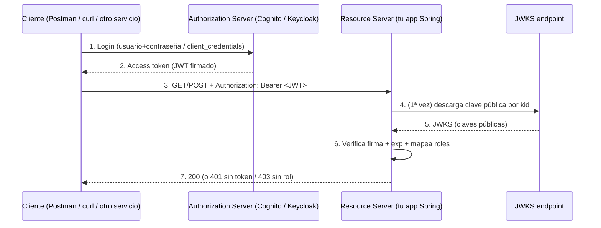
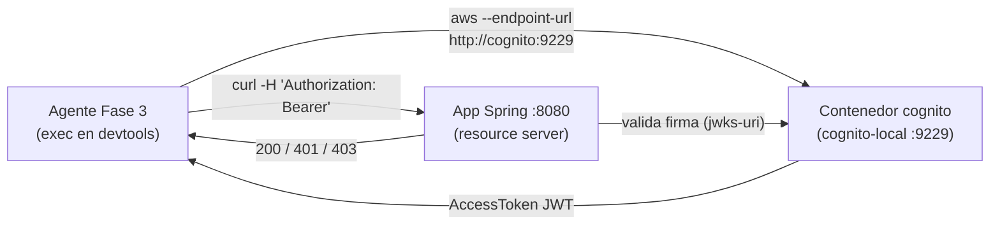

# Guía de aprendizaje: Amazon Cognito (con contraste Keycloak)

> Guía pedagógica para entender cómo funciona **Amazon Cognito** como servidor de autorización,
> en qué se parece y en qué se diferencia de **Keycloak**, cómo lo ejercitas **en local** dentro de
> este proyecto (emulador `cognito-local`) y qué pasos das para usar el **servicio real de AWS**.
>
> Público: personas (y agentes) que trabajan con proyectos generados por `@dsl/springboot-generator`.
> No asume conocimiento previo de OAuth2/OIDC — cada término se define antes de usarse.

---

## 0. Mapa mental en una frase

Tu aplicación Spring Boot generada **no gestiona contraseñas ni emite tokens**: solo **verifica** tokens
que le llegan. Quien crea usuarios y emite los tokens es un **servidor de autorización externo**
(Keycloak o Amazon Cognito). Esta guía explica ese servidor externo.

---

## 1. El problema: ¿por qué un servidor de autorización?

Imagina el bounded context `products` del sistema: `POST /products` solo puede ejecutarlo un usuario con
rol `ADMIN` o `CATALOG_MANAGER`. Hay dos formas de resolverlo:

- ❌ **Que la API gestione usuarios y contraseñas.** Tendrías que guardar contraseñas (hashearlas,
  rotarlas), implementar login, recuperación de cuenta, MFA… en **cada** microservicio. Frágil y
  repetitivo.
- ✅ **Delegar la identidad a un servidor especializado (un IdP).** La API deja de saber de contraseñas:
  solo recibe un **token firmado** que prueba "quién eres y qué puedes hacer", y lo **verifica**.

### Vocabulario mínimo

| Término | Qué es | Quién lo hace aquí |
|---|---|---|
| **Autenticación** | Probar **quién eres** (login) | El IdP |
| **Autorización** | Decidir **qué puedes hacer** (roles/permisos) | El IdP emite roles; la API los aplica |
| **IdP / Identity Provider** | Directorio de usuarios + login | Keycloak / Cognito |
| **Authorization Server** | **Emite** tokens (OAuth2/OIDC) | Keycloak / Cognito |
| **Resource Server** | **Valida** tokens y protege recursos | **Tu app Spring generada** |

> **Clave:** el generador produce un **resource server**. Cognito y Keycloak son el **authorization
> server**. Nunca al revés.

---

## 2. Fundamentos comunes: OAuth2, OIDC, JWT y JWKS

Cognito y Keycloak son **el mismo tipo de pieza** (ambos hablan OAuth2/OIDC); cambian el nombre de las
cosas y cómo se despliegan. Entender esta base te sirve para los dos.

### 2.1 El JWT (JSON Web Token)

Un token es un **JWT**: un string con tres partes separadas por puntos — `header.payload.signature`.

- **header**: algoritmo de firma (p. ej. `RS256`) y `kid` (id de la clave que firmó).
- **payload**: los **claims** (afirmaciones sobre el usuario). Los relevantes:
  - `iss` (issuer): quién emitió el token.
  - `aud` (audience): para quién es.
  - `exp`: cuándo expira.
  - `sub`: id único del usuario.
  - el claim de **roles/grupos** (aquí está la diferencia clave entre providers, ver §4).
- **signature**: firma criptográfica hecha con la **clave privada** del authorization server.

### 2.2 JWKS: verificar sin conocer la clave privada

El resource server necesita comprobar que la firma es auténtica **sin** tener la clave privada. Para eso
el authorization server publica su **clave pública** en un endpoint estándar: el **JWKS**
(*JSON Web Key Set*), típicamente en `.../.well-known/jwks.json`.

El flujo de verificación:
1. Llega un JWT con `kid = K1` en su header.
2. El resource server descarga el JWKS (y lo cachea), busca la clave con `kid = K1`.
3. Verifica la firma con esa clave pública. Si cuadra y no expiró → token válido.

En el proyecto generado, esto lo configura `SecurityConfig`, que lee **una sola** propiedad:

```yaml
# src/main/resources/parameters/{env}/auth-server.yaml
auth:
  jwks-uri: https://.../.well-known/jwks.json
  issuer-uri: https://...
```

> Como el resource server valida **por JWKS**, es **agnóstico del provider**: el mismo código Spring
> funciona con Keycloak o Cognito con solo cambiar la `jwks-uri`. Esa es la razón de que soportar Cognito
> haya sido, sobre todo, cuestión de infraestructura y de mapear el claim de roles (§4).

### 2.3 Grant types que usa este proyecto

- **Usuario (password / `USER_PASSWORD_AUTH`):** un humano con usuario+contraseña obtiene un token. Es lo
  que usan los flujos de prueba de la Fase 3.
- **Máquina-a-máquina (`client_credentials`):** un servicio se autentica con `client_id`+`client_secret`
  (sin usuario) para llamar a otro servicio.

### 2.4 Diagrama del flujo (común a ambos providers)



---

## 3. Amazon Cognito, pieza por pieza

Cognito es el IdP **gestionado** de AWS: no lo instalas ni lo mantienes, es un servicio de la nube (con la
excepción del emulador local que verás en §5).

### 3.1 User Pool — el directorio de usuarios

Un **User Pool** es "la base de datos de usuarios" con su propio login. Cada User Pool tiene un
identificador como `us-east-1_aBcDeFgHi` y te da automáticamente:
- un **issuer**: `https://cognito-idp.{region}.amazonaws.com/{userPoolId}`
- un **JWKS**: `{issuer}/.well-known/jwks.json`

Estos dos son exactamente lo que necesita tu resource server.

### 3.2 App Client — la aplicación registrada

Un **App Client** representa a "la aplicación que pide tokens". Dos sabores:
- **Público** (sin secret): pensado para clientes que no pueden guardar secretos (SPA, apps móviles) y
  para **pruebas**. Con `InitiateAuth` no necesita `SECRET_HASH`.
- **Confidencial** (con secret): para backends. Si tiene secret, `InitiateAuth` exige calcular un
  `SECRET_HASH` (HMAC de usuario+clientId con el secret) — un paso extra que complica las pruebas.

> En este proyecto el app client sembrado en local es **público**, justo para que obtener un token sea un
> comando de una línea sin `SECRET_HASH`.

### 3.3 Groups — de dónde salen los roles

Un **Group** de Cognito agrupa usuarios (p. ej. `ADMIN`, `CATALOG_MANAGER`). Cuando un usuario pertenece a
grupos, su token incluye el claim **`cognito:groups`** con la lista de grupos. **Ese claim es el que el
resource server traduce a roles de Spring.**

### 3.4 ID token vs Access token

Cognito emite varios tokens al hacer login. Los dos que importan:
- **ID token**: describe **quién** es el usuario (nombre, email…). Es para el **cliente**, no para
  autorizar llamadas a la API.
- **Access token**: describe **qué puede hacer** (incluye `cognito:groups`, `scope`). **Es el que valida
  el resource server.**

> Por eso, al pedir un token guardas `AuthenticationResult.**AccessToken**`, no el ID token.

### 3.5 Cómo lo mapea el generador

En `config/stack-catalog.json`, la entrada de Cognito describe **cómo leer los claims**:

```json
{
  "id": "cognito",
  "label": "AWS Cognito",
  "rolesClaimType": "flat",
  "rolesClaimName": "cognito:groups",
  "principalClaimName": "username",
  "permissionsClaimName": "permissions"
}
```

`rolesClaimType: flat` selecciona la rama "plana" de
`templates/shared/infrastructure/security/JwtAuthConverter.java.ejs`, que hace:

```java
JwtGrantedAuthoritiesConverter rolesConverter = new JwtGrantedAuthoritiesConverter();
rolesConverter.setAuthoritiesClaimName("cognito:groups"); // lee el claim de grupos
rolesConverter.setAuthorityPrefix("ROLE_");               // ADMIN -> ROLE_ADMIN
```

Es decir: el grupo `ADMIN` de Cognito se convierte en la autoridad `ROLE_ADMIN` de Spring, que es lo que
espera `@PreAuthorize(hasAnyRole('ADMIN'))` en los controllers generados.

> ⚠️ **Por eso los grupos NO llevan el prefijo `ROLE_`.** El converter lo añade. Si nombraras el grupo
> `ROLE_ADMIN` en Cognito, acabarías con `ROLE_ROLE_ADMIN` → nunca coincide → 403 en todo.

---

## 4. Cognito ↔ Keycloak: mismo concepto, distinto vestido

Ambos son authorization servers OIDC. Si ya entiendes Keycloak, Cognito es un renombrado + un modelo de
despliegue distinto (gestionado vs self-hosted).

### 4.1 La diferencia técnica que más importa: cómo viajan los roles

- **Keycloak** mete los roles **anidados**: `realm_access.roles = ["ADMIN", ...]`. Hay que "entrar" a un
  objeto (`realm_access`) y sacar el array `roles`. Por eso su config es `rolesClaimType: **nested**`
  (`rolesClaimParent: realm_access`, `rolesClaimField: roles`) y el converter lee
  `jwt.getClaimAsMap("realm_access").get("roles")`.
- **Cognito** los mete **planos**: `cognito:groups = ["ADMIN", ...]` es un claim de primer nivel. Por eso
  `rolesClaimType: **flat**` y basta un `JwtGrantedAuthoritiesConverter` sobre `cognito:groups`.

Esta es **toda** la diferencia relevante en el código Java generado; el resto (validación por JWKS,
prefijo `ROLE_`, `@PreAuthorize`) es idéntico.

### 4.2 Tabla comparativa

| Concepto | Keycloak | Amazon Cognito |
|---|---|---|
| Despliegue | **Self-hosted** (tú corres el contenedor) | **Gestionado** por AWS / emulador local para dev |
| "Tenant" / espacio | **Realm** | **User Pool** |
| Aplicación registrada | **Client** | **App Client** |
| Roles en el token | `realm_access.roles` (**anidado**) | `cognito:groups` (**plano**) |
| Mapeo en el generador | `rolesClaimType: nested` | `rolesClaimType: flat` |
| Claim del principal | `preferred_username` | `username` |
| Endpoint de token | `/realms/{realm}/protocol/openid-connect/token` | `InitiateAuth` (API) o `/oauth2/token` (hosted domain) |
| Login de usuario | `grant_type=password` | `AuthFlow=USER_PASSWORD_AUTH` |
| M2M | `grant_type=client_credentials` | `client_credentials` **solo** vía hosted domain `/oauth2/token` |
| Provisión local (este repo) | `keycloak/realm-export.json` + contenedor Keycloak | `cognito/` (config+db) + contenedor `cognito-local` |
| Secret en pruebas | client confidencial (con secret) | app client **público** (sin `SECRET_HASH`) |
| Consola admin local | `http://localhost:8180` (admin/admin) | No hay consola; se gestiona por AWS CLI |

### 4.3 Lo que comparten en el generador

Ambos providers derivan sus roles y usuarios de prueba del **mismo** código:
`src/utils/auth-seed-data.js` (`collectAuthData` / `buildTestUsers`), que escanea
`useCases[*].authorization.rolesAnyOf` en los `bc.yaml`. Solo divergen en:
- el **artefacto de siembra** (`keycloak-realm-generator.js` vs `cognito-seed-generator.js`), y
- la **rama del converter** (`nested` vs `flat`).

---

## 5. Cómo funciona a nivel LOCAL en este proyecto

Como Cognito real es un servicio de AWS, en local usamos un **emulador**: `jagregory/cognito-local`. Emite
JWTs firmados **de verdad** y expone un endpoint JWKS, así que tu app los valida igual que a los de AWS.

### 5.1 Qué levanta el `build` cuando eliges `authProvider: cognito`

- Un servicio `cognito` en `docker-compose.yaml` (imagen `jagregory/cognito-local:5.3.0`, puerto **9229**).
- La **AWS CLI** horneada en el contenedor `devtools` (así el agente de Fase 3 la usa con `--endpoint-url`).
- Una **siembra determinista** del User Pool bajo `cognito/`, generada por
  `src/generators/cognito-seed-generator.js` desde los `bc.yaml`.

### 5.2 Los ficheros generados bajo `cognito/`

| Fichero | Rol |
|---|---|
| `cognito/config.json` | `TokenConfig.IssuerDomain` (`http://localhost:9229`) y defaults del pool |
| `cognito/db/<poolId>.json` | El User Pool: `{ Options, Users, Groups }`. Un **grupo por rol**, un **usuario por actor** (`bc.yaml`), password `{usuario}123`, y la membresía usuario→grupo que produce `cognito:groups` |
| `cognito/db/clients.json` | El **app client público** con `USER_PASSWORD_AUTH` habilitado |

El **PoolId es fijo** (`local_<slug-del-sistema>`, p. ej. `local_testauthcognitosystem`) porque el nombre
del fichero es el id del pool. Gracias a eso, la `jwks-uri` local puede ser **estática**:

```yaml
# src/main/resources/parameters/local/auth-server.yaml (perfil local, cognito)
auth:
  jwks-uri: http://localhost:9229/local_<slug>/.well-known/jwks.json
  issuer-uri: http://localhost:9229/local_<slug>
```

> Ejemplo real: para el system `products` del scenario, los grupos son `ADMIN`, `CATALOG_MANAGER`,
> `CUSTOMER` y los usuarios `admin` (password `admin123`) y `customer` (`customer123`).

### 5.3 Diagrama del flujo local



### 5.4 Pasos prácticos

```bash
# 1. Levantar infraestructura (DB + cognito-local + devtools)
docker compose up -d

# 2. Verificar que el emulador responde (usa la AWS CLI del devtools)
./validate-infra.sh
# → [PASS] Cognito (cognito-local) reachable

# 3. Obtener un access token para un usuario sembrado.
#    Sustituye {poolId}/{clientId} por los del pool (mira cognito/db/ o auth-server.yaml).
TOKEN=$(docker exec -e AWS_ACCESS_KEY_ID=local -e AWS_SECRET_ACCESS_KEY=local <sistema>-devtools \
  aws --endpoint-url http://cognito:9229 --region local cognito-idp admin-initiate-auth \
    --user-pool-id {poolId} --client-id {clientId} \
    --auth-flow ADMIN_USER_PASSWORD_AUTH \
    --auth-parameters USERNAME=admin,PASSWORD=admin123 \
  | jq -r .AuthenticationResult.AccessToken)

# 4. (Opcional) inspeccionar el payload: verás "cognito:groups": ["ADMIN", ...]
echo "$TOKEN" | cut -d. -f2 | base64 -d 2>/dev/null | jq .

# 5. Llamar a un endpoint protegido con el token
curl -s http://localhost:8080/products \
  -H "Authorization: Bearer ${TOKEN}" | jq .
```

> Los mismos snippets (health check, obtención de token) viven, listos para la Fase 3, en
> `src/skills/infra-provisioning/references/infra-validation-guide.md` (sección Cognito) y en
> `src/agents/flow-validator.agent.md`.

### 5.5 Límites del emulador (qué NO reproduce)

El emulador cubre lo esencial (usuarios, grupos, `InitiateAuth`, JWKS), pero **no** replica:
- MFA, verificación real de email/SMS, ni triggers Lambda.
- La **Hosted UI** ni el dominio `/oauth2/token` para `client_credentials` M2M.
- Rotación de claves: la clave de firma del emulador es **fija** (kid estable).

Para todo eso necesitas el servicio real (§6).

---

## 6. Pasos para usar el servicio REAL de AWS

Cuando despliegues de verdad, sustituyes el emulador por un User Pool real. **No cambias código**: solo
apuntas las variables de entorno del perfil `develop`/`production` al pool real.

### 6.1 Opción A — Consola web (narrativa)

1. **Crear User Pool:** Consola AWS → *Cognito* → *Create user pool*. Elige inicio de sesión por
   `username` (coherente con `principalClaimName: username`). Al terminar, anota el **User Pool ID** y la
   **región**.
2. **Crear App Client:** dentro del pool → *App clients* → *Create app client*. Para pruebas, tipo
   **público** (sin secret) y habilita el flujo `ALLOW_USER_PASSWORD_AUTH`. Anota el **App Client ID**.
3. **Crear Groups (= tus roles):** pestaña *Groups* → crea un grupo por cada rol del sistema
   (`ADMIN`, `CATALOG_MANAGER`, …), **sin** prefijo `ROLE_`.
4. **Crear usuarios y asignarlos a grupos:** pestaña *Users* → crea el usuario, ponle contraseña
   permanente, y añádelo a sus grupos.

### 6.2 Opción B — AWS CLI (reproducible)

```bash
REGION=us-east-1

# 1. User Pool (login por username)
POOL_ID=$(aws cognito-idp create-user-pool --region $REGION \
  --pool-name mi-sistema --query 'UserPool.Id' --output text)

# 2. App client público con USER_PASSWORD_AUTH
CLIENT_ID=$(aws cognito-idp create-user-pool-client --region $REGION \
  --user-pool-id "$POOL_ID" --client-name mi-sistema-app \
  --explicit-auth-flows ALLOW_USER_PASSWORD_AUTH ALLOW_REFRESH_TOKEN_AUTH \
  --query 'UserPoolClient.ClientId' --output text)

# 3. Un grupo por rol (nombres SIN ROLE_)
aws cognito-idp create-group --region $REGION --user-pool-id "$POOL_ID" --group-name ADMIN
aws cognito-idp create-group --region $REGION --user-pool-id "$POOL_ID" --group-name CATALOG_MANAGER

# 4. Un usuario, contraseña permanente y su membresía
aws cognito-idp admin-create-user --region $REGION --user-pool-id "$POOL_ID" \
  --username admin --message-action SUPPRESS
aws cognito-idp admin-set-user-password --region $REGION --user-pool-id "$POOL_ID" \
  --username admin --password 'ClaveFuerte#123' --permanent
aws cognito-idp admin-add-user-to-group --region $REGION --user-pool-id "$POOL_ID" \
  --username admin --group-name ADMIN
```

### 6.3 Conectar el proyecto generado al pool real

Los perfiles `develop`/`production` ya están parametrizados por variables de entorno
(`templates/base/resources/parameters/{develop,production}/auth-server.yaml.ejs`):

```yaml
auth:
  jwks-uri: ${AUTH_JWKS_URI}
  issuer-uri: ${AUTH_ISSUER_URI}
```

Define en tu entorno / pipeline:

```bash
export AUTH_ISSUER_URI="https://cognito-idp.{region}.amazonaws.com/{userPoolId}"
export AUTH_JWKS_URI="${AUTH_ISSUER_URI}/.well-known/jwks.json"
```

Y listo: el resource server valida los tokens de AWS igual que validaba los del emulador. **Sin tocar
código Java.**

### 6.4 Obtener un token contra el pool real (para probar)

```bash
aws cognito-idp initiate-auth --region {region} \
  --client-id {clientId} --auth-flow USER_PASSWORD_AUTH \
  --auth-parameters USERNAME=admin,PASSWORD='ClaveFuerte#123' \
  --query 'AuthenticationResult.AccessToken' --output text
```

### 6.5 Diferencias operativas frente al emulador

- **`SECRET_HASH`:** si tu app client tiene secret (confidencial), `InitiateAuth` exige enviar un
  `SECRET_HASH`. Para pruebas simples, usa un app client **público**.
- **M2M (`client_credentials`):** en Cognito real **no** se pide en `InitiateAuth`; necesitas configurar
  un **dominio hospedado** y pedir el token a `POST https://{dominio}/oauth2/token` con
  `grant_type=client_credentials`.
- **Políticas de contraseña / verificación:** el pool real puede exigir complejidad de contraseña,
  verificación de email/teléfono y forzar cambio en el primer login (usa `--permanent` para evitarlo en
  usuarios de servicio).
- **Nombres de grupo = roles esperados:** deben coincidir exactamente con los roles del sistema
  (`rolesAnyOf` sin `ROLE_`), o `@PreAuthorize` fallará con 403.

---

## 7. Referencias en el repositorio

- Catálogo de providers y claims: [`config/stack-catalog.json`](../config/stack-catalog.json)
  (sección `authProviders`).
- Siembra local de Cognito: [`src/generators/cognito-seed-generator.js`](../src/generators/cognito-seed-generator.js).
- Extracción compartida de roles/usuarios: [`src/utils/auth-seed-data.js`](../src/utils/auth-seed-data.js).
- Converter de JWT (rama `flat` para Cognito):
  [`templates/shared/infrastructure/security/JwtAuthConverter.java.ejs`](../templates/shared/infrastructure/security/JwtAuthConverter.java.ejs).
- Perfil local (jwks-uri del emulador):
  [`templates/base/resources/parameters/local/auth-server.yaml.ejs`](../templates/base/resources/parameters/local/auth-server.yaml.ejs).
- Cheatsheet de infra Fase 3 (comandos de token):
  [`src/skills/infra-provisioning/references/infra-validation-guide.md`](../src/skills/infra-provisioning/references/infra-validation-guide.md).
- Guía Postman (obtención de token por rol):
  [`src/skills/postman-authoring/references/postman-collection-guide.md`](../src/skills/postman-authoring/references/postman-collection-guide.md).
- Escenario de test de referencia: `test/scenarios/auth-cognito/`.
