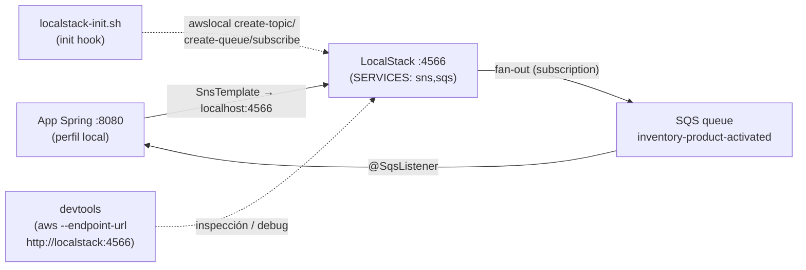

# Guía de aprendizaje: AWS SNS/SQS (con contraste RabbitMQ)

> Guía pedagógica para entender cómo funciona la mensajería asíncrona con **Amazon SNS + SQS**
> (vía **Spring Cloud AWS**), en qué se parece y en qué se diferencia de **RabbitMQ**, cómo la
> ejercitas **en local** dentro de este proyecto (emulador `LocalStack`) y qué pasos das para usar
> los **recursos reales de AWS**.
>
> Público: personas (y agentes) que trabajan con proyectos generados por `@dsl/springboot-generator`.
> No asume conocimiento previo de mensajería — cada término se define antes de usarse.

---

## 0. Mapa mental en una frase

Cuando un bounded context (BC) termina una operación, **publica un evento** para que otros BCs
reaccionen, sin llamarlos directamente. En SNS/SQS eso se reparte en dos piezas:

- **SNS (topic) = un megáfono.** Publicas un evento en un *topic* y te desentiendes: SNS **no sabe
  ni le importa quién escucha**.
- **SQS (queue) = un buzón.** Cada consumidor tiene su propia **cola**, donde los mensajes se
  acumulan y esperan hasta ser procesados y confirmados (ack).

El reparto de "un evento → muchos consumidores" (**fan-out**) lo resuelve una **suscripción**
SNS→SQS: cada cola se suscribe al topic que le interesa. Tu app **publica en un topic** y
**consume de una cola**; nunca al revés.

```
                              ┌── SQS queue (inventory) ──► @SqsListener (BC inventory)
SNS topic  ──(subscription)───┤
(catalog)                     └── SQS queue (reporting) ──► @SqsListener (BC reporting)
```

---

## 1. El problema: ¿por qué mensajería asíncrona entre BCs?

Imagina dos bounded contexts: `catalog` activa un producto y `inventory` necesita enterarse para
crear su registro de stock. Hay dos formas de resolverlo:

- ❌ **Llamada síncrona directa** (`catalog` llama por HTTP a `inventory`). Acopla los dos servicios:
  si `inventory` está caído, la operación de `catalog` falla; para añadir un tercer interesado hay
  que tocar el código de `catalog`.
- ✅ **Evento de integración.** `catalog` **publica** `ProductActivated` y sigue su camino.
  `inventory` (y cualquier otro BC) **reacciona** cuando puede. Desacople total: productor y
  consumidores no se conocen, y añadir consumidores no toca al productor.

### Vocabulario mínimo

| Término | Qué es | En SNS/SQS |
|---|---|---|
| **Evento de integración** | Un hecho de negocio que cruza BCs (`ProductActivated`) | El **payload** que se publica |
| **Topic** | Punto de publicación "de uno a muchos" | Un **SNS topic** |
| **Queue** | Buzón de un consumidor concreto | Una **SQS queue** |
| **Subscription** | Enlace topic → queue (define el fan-out) | Una **subscription** SNS→SQS |
| **DLQ** (*dead-letter queue*) | Cola donde acaban los mensajes que fallan repetidamente | Una SQS queue `-dlq` |
| **Ack** (*acknowledgement*) | Confirmar "lo procesé, bórralo" | `Acknowledgement.acknowledge(...)` |
| **Fan-out** | Un evento entregado a varias colas a la vez | Varias subscriptions al mismo topic |

> **Clave:** SNS/SQS y RabbitMQ resuelven **el mismo problema** (pub/sub desacoplado). Cambia el
> vestido, no el concepto (ver §4).

---

## 2. Fundamentos comunes: el patrón publish/subscribe

RabbitMQ y SNS/SQS son **el mismo tipo de pieza** (un *message broker* pub/sub). Entender esta base
te sirve para los dos.

Lo que comparten:

1. **El productor no conoce a los consumidores.** Publica y se olvida.
2. **Entrega desacoplada.** El mensaje espera en una cola hasta que el consumidor esté disponible.
3. **Reintentos + DLQ.** Si el consumidor falla, el mensaje se reintenta; tras N intentos va a una
   *dead-letter queue* para no perderlo ni bloquear la cola.
4. **Ack manual.** El mensaje se borra de la cola **solo después** de procesarse con éxito. Si el
   handler lanza excepción, no se hace ack → el mensaje vuelve a estar visible y se reintenta.

### 2.1 El formato del payload: `EventEnvelope`

Independientemente del broker, el generador **envuelve** cada evento en un `EventEnvelope`: un sobre
JSON con el `data` (el evento en sí) y una `metadata` que incluye `eventId`, `eventType` y el
**`correlationId`** (tomado del `MDC`, para trazar un flujo a través de varios saltos). El listener
deserializa siempre a `EventEnvelope<...>`. Esto es idéntico en Rabbit, Kafka y SNS/SQS.

### 2.2 Diagrama del flujo genérico

```mermaid
sequenceDiagram
    participant P as Productor (BC catalog)
    participant B as Broker (SNS topic / Rabbit exchange)
    participant Q as Cola(s) del consumidor
    participant C as Consumidor (BC inventory)

    P->>B: 1. publica EventEnvelope(ProductActivated)
    B->>Q: 2. fan-out a cada cola suscrita
    Q->>C: 3. entrega el mensaje
    C->>C: 4. procesa (dispatch al use case)
    alt éxito
        C->>Q: 5a. ACK → se borra de la cola
    else fallo
        C-->>Q: 5b. sin ACK → reintento; tras N → DLQ
    end
```

---

## 3. SNS/SQS pieza por pieza

### 3.1 SNS topic — el punto de publicación

El adapter de salida publica con **`SnsTemplate`** (auto-configurado por el starter). El nombre del
topic **no está hardcodeado**: se inyecta por `@Value` desde `sns.topics.*` (ver §5.2), y
`SnsTemplate` lo resuelve a su ARN en runtime.

```java
// templates/messaging/SnsSqsMessageBroker.java.ejs (extracto de lo generado)
@Value("${sns.topics.product-activated}")
private String productActivatedTopic;

private final SnsTemplate snsTemplate;

@Override
public void publishProductActivatedIntegrationEvent(ProductActivatedIntegrationEvent event) {
    EventEnvelope<ProductActivatedIntegrationEvent> envelope = EventEnvelope.of(
        productActivatedTopic, event, MDC.get("correlationId"));
    snsTemplate.sendNotification(productActivatedTopic, envelope, "ProductActivated");
}
```

> Fíjate en lo simple que es publicar: **solo el topic**. El "a quién le llega" no es problema del
> productor — lo deciden las suscripciones. (Contrasta con Rabbit, que necesita *exchange +
> routing-key*, §4.)

### 3.2 SQS queue — una cola por consumidor

El consumidor usa **`@SqsListener`**, apuntando a la cola por su nombre lógico `sqs.queues.*`:

```java
// templates/messaging/SqsListener.java.ejs (extracto)
@SqsListener("${sqs.queues.inventory-product-activated}")
public void handle(Message<String> message) {
    EventEnvelope<Map<String, Object>> event;
    try {
        event = objectMapper.readValue(message.getPayload(),
                new TypeReference<EventEnvelope<Map<String, Object>>>() {});
    } catch (JsonProcessingException e) {
        // Mensaje "envenenado" (JSON irrecuperable): ack y descarta para no bloquear la cola.
        Acknowledgement.acknowledge(message);
        return;
    }
    try {
        useCaseMediator.dispatch(new RegisterStockCommand(/* … */));
        Acknowledgement.acknowledge(message);            // ACK MANUAL tras éxito
    } catch (Exception e) {
        // Sin ack: el mensaje vuelve a visible y, tras el redrive limit, va a la DLQ.
    }
}
```

### 3.3 La suscripción con `RawMessageDelivery=true` — el detalle que hace que todo encaje

Por defecto, cuando SNS entrega a SQS, **envuelve** tu payload en otro sobre JSON de notificación
(con campos `Type`, `MessageId`, `TopicArn`, y tu contenido dentro de `Message` como string). Si eso
llegara a la cola, el listener —que espera deserializar directamente un `EventEnvelope`— fallaría.

La suscripción se crea con el atributo **`RawMessageDelivery=true`**, que le dice a SNS: *"no
envuelvas nada, entrega el cuerpo tal cual"*. Así la cola recibe **exactamente** el JSON del
`EventEnvelope` que publicó el productor, y el `objectMapper.readValue(...)` del listener funciona.

> Regla mental: **productor y consumidor acuerdan el `EventEnvelope`; `RawMessageDelivery=true` es lo
> que evita que SNS rompa ese acuerdo.**

### 3.4 DLQ + RedrivePolicy — a dónde va un mensaje que falla

Cada cola se crea junto a una **DLQ** hermana (`{cola}-dlq`) y una **RedrivePolicy** con
`maxReceiveCount: 5`. Semántica: si un mensaje se recibe 5 veces sin ack exitoso (porque el handler
sigue lanzando excepción), SQS lo **mueve a la DLQ** en lugar de reintentar para siempre. La DLQ es
tu "bandeja de fallos" para inspección y reproceso manual.

### 3.5 Ack manual — cuándo se borra un mensaje

Los starters de Spring Cloud AWS auto-configuran `SnsTemplate`/`SqsTemplate`. Lo **único** que el
generador sobrescribe es el *container factory* del listener, para forzar **ack MANUAL**:

```java
// templates/messaging/SnsSqsConfig.java.ejs
@Bean
public SqsMessageListenerContainerFactory<Object> defaultSqsListenerContainerFactory(
        SqsAsyncClient sqsAsyncClient) {
    return SqsMessageListenerContainerFactory.builder()
            .configure(options -> options.acknowledgementMode(AcknowledgementMode.MANUAL))
            .sqsAsyncClient(sqsAsyncClient)
            .build();
}
```

Con esto, un mensaje se borra de la cola **solo** tras `Acknowledgement.acknowledge(message)`. Tres
caminos posibles en el listener (§3.2):

| Situación | Acción | Efecto |
|---|---|---|
| Procesado con éxito | `acknowledge` | Se borra de la cola |
| Excepción de negocio | **no** ack | Vuelve a visible → reintento → tras 5, DLQ |
| JSON irrecuperable (envenenado) | `acknowledge` y `return` | Se descarta (no tiene sentido reintentarlo) |

> Es el equivalente al `ack-mode: manual_immediate` de Kafka y al `AcknowledgeMode.MANUAL` de Rabbit.

### 3.6 Cómo lo mapea el generador

El generador es **data-driven a partir de los `bc.yaml`**: recorre `domainEvents.published` /
`domainEvents.consumed` de todos los BCs y construye la topología con
`buildSnsSqsTopology(allBcYamls)` (en `src/generators/messaging-generator.js`).

**Sanitización de nombres.** SNS y SQS solo aceptan `[A-Za-z0-9_-]`; **los puntos son ilegales**
(a diferencia de las routing-keys de Rabbit o los topics de Kafka). Por eso todo nombre derivado se
pasa por:

```js
function sanitizeSnsSqsName(name) {
  return String(name).replace(/[^a-zA-Z0-9_-]/g, '-');
}
```

Así `catalog.product.activated` → `catalog-product-activated`.

`buildSnsSqsTopology` produce cuatro colecciones (mapeo conceptual: *exchanges→topics,
queues→queues, bindings→subscriptions*):

| Colección | Origen | Ejemplo |
|---|---|---|
| `topics` | cada `published` no-interno | `product-activated: catalog-product-activated` |
| `queues` | cada `consumed` / proyección persistente | `inventory-product-activated: inventory-product-activated` |
| `dlqs` | 1 por queue (`{queue}-dlq`) | `inventory-product-activated-dlq` |
| `subscriptions` | cada queue ↔ su topic productor | `{ queue, topic }` |

Estas colecciones alimentan **dos** salidas distintas: los YAML de propiedades por entorno
(`sns.topics.*` / `sqs.queues.*`, §5.2) y el script de provisión `localstack-init.sh` (§5.1).

**Dispatch explícito por broker.** A diferencia de las bases de datos (100% data-driven), el broker
tiene ramas `switch` explícitas por `id` (`kafka | rabbitmq | snssqs`) en el generador. Por ejemplo,
la config compartida:

```js
// src/generators/messaging-generator.js
switch (config.broker) {
  case 'rabbitmq': return generateSharedRabbitConfig(...);
  case 'kafka':    return generateSharedKafkaConfig(...);
  case 'snssqs':   return generateSharedSnsSqsConfig(...);
}
```

Y el listener se emite en `infrastructure/sqsListener/` (Rabbit → `rabbitListener/`, Kafka →
`kafkaListener/`).

### 3.7 Outbox relay (entrega confiable)

Cuando reliability está habilitado, los eventos no se publican directamente sino que se guardan en
una tabla `outbox_event` en la **misma transacción** que el cambio de dominio, y un *relay* los
reenvía después. Para SNS/SQS ese relay (`templates/shared/outbox/OutboxRelaySnsSqs.java.ejs`) hace
polling de la tabla y reenvía el payload **verbatim**:

```java
snsTemplate.sendNotification(row.getDestination(), row.getPayload(), row.getEventType());
```

Detalle clave: para brokers **topic-based** (Kafka y SNS/SQS), `row.getDestination()` es el **topic**
y no hay routing-key —el `DomainEventHandler` guarda `.destination(topic).routingKey(null)`—,
mientras que para Rabbit se guarda `.destination(exchange).routingKey(routingKey)`. El payload
almacenado ya es el `EventEnvelope` serializado, así que con `RawMessageDelivery=true` cada cola
recibe exactamente ese cuerpo.

---

## 4. SNS/SQS ↔ RabbitMQ: mismo concepto, distinto vestido

Ambos son brokers pub/sub. Si ya entiendes Rabbit, SNS/SQS es un renombrado + un **modelo de
topología distinto**.

### 4.1 La diferencia conceptual que más importa: ¿quién declara la topología?

- **RabbitMQ:** la **app declara la topología al arrancar.** El generador emite una clase Java por BC
  (`{Bc}RabbitMQConfig.java`) con `@Bean` de `Exchange`, `Queue`, `Binding` y DLX/DLQ; al iniciar,
  `RabbitAdmin` los crea en el broker. La topología "viaja" en el código.
- **SNS/SQS:** la **topología se provisiona FUERA de la app.** No hay clase Java de topología. Los
  topics, queues, DLQs y subscriptions se crean por separado: en local con `localstack-init.sh`
  (§5.1), en AWS real con IaC (§6). La app **solo referencia** los recursos por nombre lógico
  (`sns.topics.*` / `sqs.queues.*`).

Esta es la diferencia operativa que hay que interiorizar: **en Rabbit, arrancar la app crea la
infraestructura; en SNS/SQS, la infraestructura tiene que existir antes de que la app la use.**

### 4.2 Tabla comparativa

| Aspecto | AWS SNS/SQS | RabbitMQ |
|---|---|---|
| Dependencias | BOM `spring-cloud-aws-dependencies:3.3.0` + starters `sns` y `sqs` (**array**) | `spring-boot-starter-amqp` (**string**) |
| Publicar | `snsTemplate.sendNotification(topic, envelope, subject)` con `@Value("${sns.topics.*}")` | `rabbitTemplate.convertAndSend(exchange, routingKey, envelope)` con `${exchanges.*}` + `${routing-keys.*}` |
| Consumir | `@SqsListener("${sqs.queues.*}")` + `Acknowledgement.acknowledge(message)` | `@RabbitListener(queues="${queues.*}")` + `channel.basicAck(deliveryTag, false)` |
| Ack manual | `SqsMessageListenerContainerFactory` con `AcknowledgementMode.MANUAL` | `factory.setAcknowledgeMode(AcknowledgeMode.MANUAL)` |
| **Topología** | Provisionada **fuera** (LocalStack init / IaC); sin clase Java | `{Bc}RabbitMQConfig.java` con `@Bean` Exchange/Queue/Binding, creados por `RabbitAdmin` al arrancar |
| Fan-out | SNS topic → subscriptions SQS con `RawMessageDelivery=true` | TopicExchange → bindings a colas por routing-key |
| DLQ | Cola `{queue}-dlq` + `RedrivePolicy maxReceiveCount:5` | DLX `.dlx` + args `x-dead-letter-exchange` / `x-dead-letter-routing-key` |
| Nombres | Sanitizados a `[A-Za-z0-9_-]` (puntos → guiones) | Dotted permitido (`catalog.product.activated`) |
| Infra local | **1 contenedor** LocalStack (`SERVICES: sns,sqs`) + init hook `awslocal` | 1 contenedor `rabbitmq:4-management`, sin init script |
| API de ack | Alto nivel: `Acknowledgement.acknowledge(message)` | Bajo nivel: `channel.basicAck(deliveryTag, false)` |

### 4.3 Lo que comparten en el generador

- El **`EventEnvelope`** y la propagación de `correlationId` (MDC) son idénticos.
- El **ack manual** y el patrón "ack en éxito / no-ack → reintento → DLQ / ack en envenenado".
- La **derivación desde `bc.yaml`** (`domainEvents.published`/`consumed`): mismo modelo de eventos,
  distinta materialización de la topología.

---

## 5. Cómo funciona a nivel LOCAL en este proyecto

Como SNS/SQS reales son servicios de AWS, en local usamos **LocalStack**, un emulador de servicios
AWS. Habla el mismo protocolo que AWS, así que tu app (y la AWS CLI) funcionan igual apuntando a él.

### 5.1 Qué levanta el `build` cuando eliges `broker: snssqs`

Un **único** servicio `localstack` en `docker-compose.yaml`:

```yaml
# templates/base/docker/snssqs-services.yaml.ejs
localstack:
  image: localstack/localstack:3.8
  container_name: <sistema>-localstack
  ports:
    - "4566:4566"
  environment:
    SERVICES: sns,sqs
    DEBUG: "0"
    AWS_DEFAULT_REGION: us-east-1
  volumes:
    - "./localstack-init.sh:/etc/localstack/init/ready.d/init.sh:ro"
  healthcheck:
    test: ["CMD-SHELL", "awslocal sns list-topics >/dev/null 2>&1 || exit 1"]
```

El puerto **4566** es el *edge gateway* único de LocalStack (todos los servicios AWS emulados
responden ahí). El **init hook** montado en `/etc/localstack/init/ready.d/init.sh` es un directorio
especial: LocalStack ejecuta cualquier script que encuentre ahí **una vez que el gateway está listo**.

Ese script, `localstack-init.sh`, es la provisión de la topología con **`awslocal`** (la AWS CLI que
trae LocalStack, ya apuntando a `localhost:4566` con credenciales dummy):

```bash
# templates/base/docker/localstack-init.sh.ejs (generado, extracto)
set -euo pipefail

# 1) topics
awslocal sns create-topic --name catalog-product-activated >/dev/null

# 2) queues (+ DLQ con RedrivePolicy)
awslocal sqs create-queue --queue-name inventory-product-activated-dlq >/dev/null
awslocal sqs create-queue --queue-name inventory-product-activated \
  --attributes '{"RedrivePolicy":"{\"deadLetterTargetArn\":\"arn:aws:sqs:us-east-1:000000000000:inventory-product-activated-dlq\",\"maxReceiveCount\":\"5\"}"}' >/dev/null

# 3) subscription topic → queue con raw message delivery
awslocal sns subscribe \
  --topic-arn arn:aws:sns:us-east-1:000000000000:catalog-product-activated \
  --protocol sqs \
  --notification-endpoint arn:aws:sqs:us-east-1:000000000000:inventory-product-activated \
  --attributes RawMessageDelivery=true >/dev/null
```

> Este script es exactamente **"lo que en AWS real harías con IaC"** (§6). Léelo como la especificación
> ejecutable de tu topología.

### 5.2 La config Spring del perfil `local`

El perfil `local` apunta explícitamente a LocalStack con credenciales dummy:

```yaml
# src/main/resources/parameters/local/snssqs.yaml
spring:
  cloud:
    aws:
      region:
        static: us-east-1
      credentials:
        access-key: test
        secret-key: test
      sns:
        endpoint: http://localhost:4566
      sqs:
        endpoint: http://localhost:4566

sns:
  topics:
    product-activated: catalog-product-activated   # nombre lógico → nombre real del topic
sqs:
  queues:
    inventory-product-activated: inventory-product-activated
```

Los bloques `sns.topics` / `sqs.queues` son el **puente** entre el nombre lógico que usan las
anotaciones Java (`@Value("${sns.topics.product-activated}")`) y el nombre real del recurso. Deben
coincidir con lo que crea `localstack-init.sh`.

### 5.3 Diagrama del flujo local



### 5.4 Pasos prácticos

```bash
# 1. Levantar infraestructura (DB + LocalStack + devtools).
#    LocalStack, al estar listo, ejecuta localstack-init.sh y crea topics/queues/subscriptions.
docker compose up -d

# 2. Verificar que el broker responde y la topología existe.
./validate-infra.sh
# Internamente corre (desde devtools):
#   aws --endpoint-url http://localstack:4566 --region us-east-1 sns list-topics

# 3. Listar topics / queues creados (desde el host o devtools)
aws --endpoint-url http://localhost:4566 --region us-east-1 sns list-topics
aws --endpoint-url http://localhost:4566 --region us-east-1 sqs list-queues

# 4. (Debug) publicar un evento a mano y ver que llega a la cola
aws --endpoint-url http://localhost:4566 --region us-east-1 sns publish \
  --topic-arn arn:aws:sns:us-east-1:000000000000:catalog-product-activated \
  --message '{"data":{"productId":"p-1"},"metadata":{"eventType":"ProductActivated"}}'

aws --endpoint-url http://localhost:4566 --region us-east-1 sqs receive-message \
  --queue-url http://localhost:4566/000000000000/inventory-product-activated
```

> Nota sobre el host: la **app** usa `http://localhost:4566` (perfil local). Desde el contenedor
> `devtools`, en cambio, el host es `http://localstack:4566` (nombre del servicio en la red Docker).

### 5.5 Límites del emulador (qué NO reproduce fielmente)

LocalStack cubre lo esencial (topics, queues, subscriptions, DLQ, `RawMessageDelivery`), pero **no**
es AWS real:
- No aplica **IAM** de verdad (cualquier credencial dummy vale) — no descubrirás permisos faltantes
  hasta producción.
- No reproduce límites/latencias/cuotas reales, ni políticas de acceso entre cuentas.
- La cuenta es siempre `000000000000` y los ARN son sintéticos.

Para todo eso necesitas el servicio real (§6).

---

## 6. Pasos para usar los recursos REALES de AWS

La gran ventaja del diseño: **no cambias código Java.** El adapter y el listener solo referencian
nombres lógicos (`sns.topics.*`, `sqs.queues.*`); `SnsTemplate`/`SqsTemplate` los auto-configura
Spring Cloud AWS leyendo las propiedades del perfil. Migrar a AWS real es (a) usar el perfil que no
apunta a LocalStack y (b) provisionar la topología en AWS.

### 6.1 El perfil `production`: sin endpoint, sin credenciales estáticas

```yaml
# src/main/resources/parameters/production/snssqs.yaml
spring:
  cloud:
    aws:
      region:
        static: ${AWS_REGION}
      # Sin endpoint override y sin credenciales estáticas: la app habla con AWS real
      # y resuelve credenciales por la default provider chain (IAM role / env).
sns:
  topics:
    product-activated: catalog-product-activated
sqs:
  queues:
    inventory-product-activated: inventory-product-activated
```

Diferencias respecto a `local`:
- **Desaparece** `sns.endpoint` / `sqs.endpoint` → Spring Cloud AWS apunta al endpoint real de AWS
  de la región.
- **Desaparecen** las credenciales estáticas → se usa la *default credentials provider chain*: en
  producción, típicamente el **IAM role** de la tarea ECS / instancia EC2 / pod (IRSA). No metes
  claves en el YAML.
- Solo queda `region.static: ${AWS_REGION}`.

> Los perfiles `develop` / `test` son un punto intermedio: mismos valores que `local` pero **todo
> parametrizado por variables de entorno** con defaults hacia LocalStack
> (`${AWS_SNS_ENDPOINT:http://localhost:4566}`, `${AWS_REGION:us-east-1}`,
> `${AWS_ACCESS_KEY_ID:test}`, …). Así puedes apuntar a AWS real solo exportando esas variables, sin
> tocar el archivo.

### 6.2 Provisionar la topología en AWS (el equivalente real de `localstack-init.sh`)

En AWS real deberías crear los recursos con **IaC** (Terraform / CloudFormation / CDK). Conceptualmente
son los mismos tres pasos del init script; en AWS CLI directa se verían así:

```bash
REGION=us-east-1

# 1) SNS topic
TOPIC_ARN=$(aws sns create-topic --region $REGION \
  --name catalog-product-activated --query 'TopicArn' --output text)

# 2) DLQ + cola principal con RedrivePolicy apuntando a la DLQ
DLQ_URL=$(aws sqs create-queue --region $REGION \
  --queue-name inventory-product-activated-dlq --query 'QueueUrl' --output text)
DLQ_ARN=$(aws sqs get-queue-attributes --region $REGION --queue-url "$DLQ_URL" \
  --attribute-names QueueArn --query 'Attributes.QueueArn' --output text)

QUEUE_URL=$(aws sqs create-queue --region $REGION \
  --queue-name inventory-product-activated \
  --attributes "{\"RedrivePolicy\":\"{\\\"deadLetterTargetArn\\\":\\\"$DLQ_ARN\\\",\\\"maxReceiveCount\\\":\\\"5\\\"}\"}" \
  --query 'QueueUrl' --output text)
QUEUE_ARN=$(aws sqs get-queue-attributes --region $REGION --queue-url "$QUEUE_URL" \
  --attribute-names QueueArn --query 'Attributes.QueueArn' --output text)

# 3) Suscribir la cola al topic, con RawMessageDelivery=true (imprescindible, §3.3)
aws sns subscribe --region $REGION \
  --topic-arn "$TOPIC_ARN" --protocol sqs --notification-endpoint "$QUEUE_ARN" \
  --attributes RawMessageDelivery=true
```

> ⚠️ **En AWS real falta un paso que LocalStack te regala:** la **SQS access policy** que autoriza al
> topic a enviar mensajes a la cola (`Principal: sns.amazonaws.com` con `Condition` sobre el
> `aws:SourceArn` del topic). Sin ella, la suscripción existe pero los mensajes no llegan. Tu IaC debe
> incluirla.

### 6.3 Permisos IAM que necesita la app

El IAM role bajo el que corre la app necesita, como mínimo:
- **Productor:** `sns:Publish` sobre los topics que publica.
- **Consumidor:** `sqs:ReceiveMessage`, `sqs:DeleteMessage` y `sqs:GetQueueAttributes` sobre las colas
  que consume.

En local esto es invisible (LocalStack no aplica IAM), por eso es el error más típico al pasar a
producción.

### 6.4 Diferencias operativas frente al emulador

| Aspecto | Local (LocalStack) | AWS real |
|---|---|---|
| Endpoint | `sns/sqs.endpoint: http://localhost:4566` | sin endpoint (region real) |
| Credenciales | estáticas `test`/`test` | *default provider chain* (IAM role) |
| IAM | no se aplica | **se aplica** (permisos + SQS access policy obligatorios) |
| Topología | `localstack-init.sh` (init hook) | IaC (Terraform/CloudFormation/CDK) |
| Cuenta / ARN | `000000000000`, sintéticos | tu account id real |
| Perfil Spring | `local` | `production` (o `develop`/`test` con env vars) |

Lo que **no** cambia: el código Java, los nombres lógicos `sns.topics.*` / `sqs.queues.*`, el
`RawMessageDelivery=true`, la `RedrivePolicy` y el patrón de ack.

---

## 7. Referencias en el repositorio

- Catálogo de brokers y dependencias: [`config/stack-catalog.json`](../config/stack-catalog.json)
  (sección `messageBrokers`, `id: snssqs`; imagen en `dockerImages.localstack`).
- Dispatch por broker y `buildSnsSqsTopology` / `sanitizeSnsSqsName`:
  [`src/generators/messaging-generator.js`](../src/generators/messaging-generator.js).
- Publisher (SNS): [`templates/messaging/SnsSqsMessageBroker.java.ejs`](../templates/messaging/SnsSqsMessageBroker.java.ejs).
- Consumer (SQS): [`templates/messaging/SqsListener.java.ejs`](../templates/messaging/SqsListener.java.ejs).
- Ack manual: [`templates/messaging/SnsSqsConfig.java.ejs`](../templates/messaging/SnsSqsConfig.java.ejs).
- Outbox relay: [`templates/shared/outbox/OutboxRelaySnsSqs.java.ejs`](../templates/shared/outbox/OutboxRelaySnsSqs.java.ejs).
- Infra local (contenedor + init hook):
  [`templates/base/docker/snssqs-services.yaml.ejs`](../templates/base/docker/snssqs-services.yaml.ejs),
  [`templates/base/docker/localstack-init.sh.ejs`](../templates/base/docker/localstack-init.sh.ejs).
- Config por entorno:
  [`templates/base/resources/parameters/local/snssqs.yaml.ejs`](../templates/base/resources/parameters/local/snssqs.yaml.ejs)
  · [`.../develop/snssqs.yaml.ejs`](../templates/base/resources/parameters/develop/snssqs.yaml.ejs)
  · [`.../production/snssqs.yaml.ejs`](../templates/base/resources/parameters/production/snssqs.yaml.ejs).
- Ramas snssqs en generadores:
  [`src/generators/docker-generator.js`](../src/generators/docker-generator.js) ·
  [`src/generators/outbox-generator.js`](../src/generators/outbox-generator.js).
- Salida real de referencia: `test/scenarios/event-snssqs-full/expected/`.
- Guía hermana (auth): [`docs/amazon-cognito-guia.md`](./amazon-cognito-guia.md).
