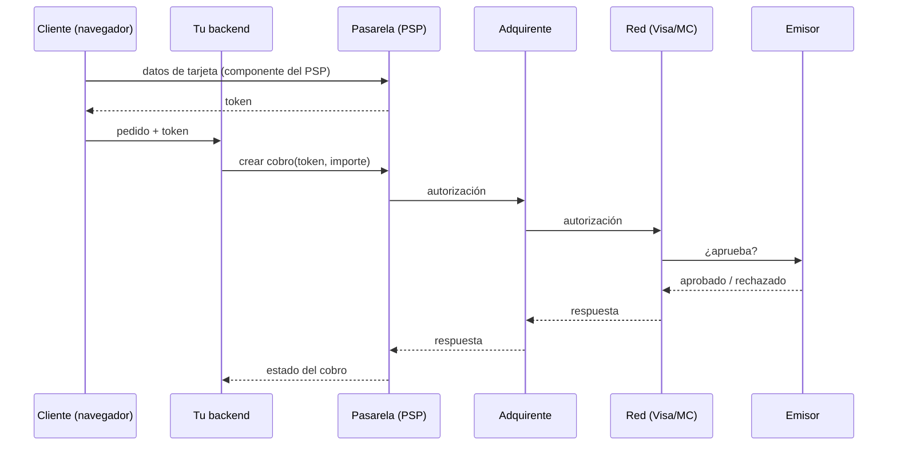
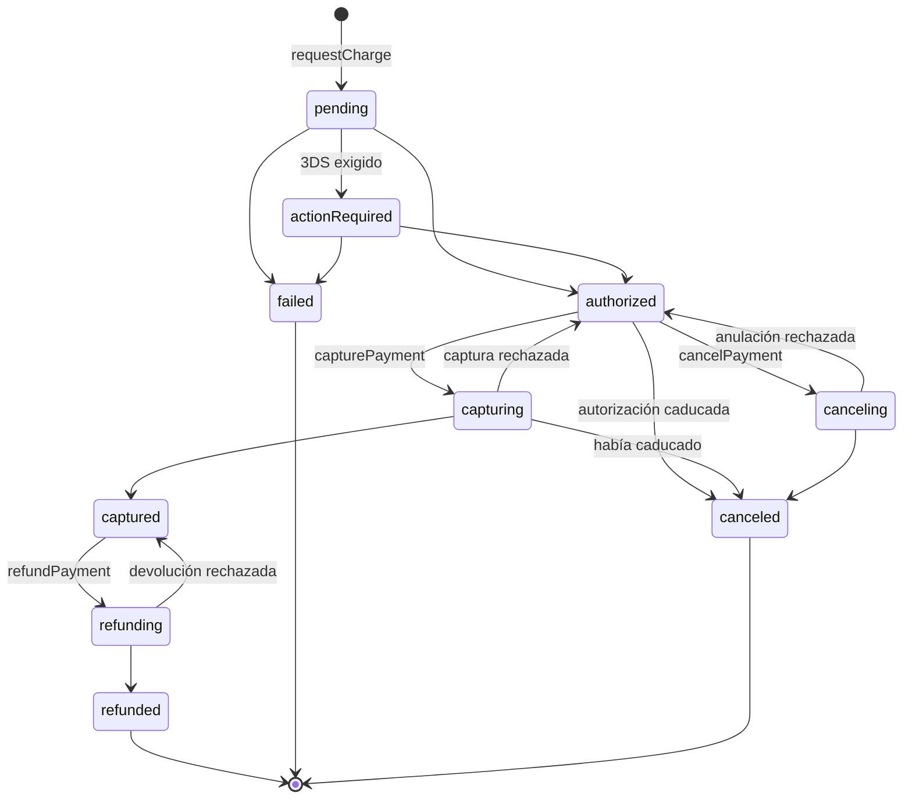
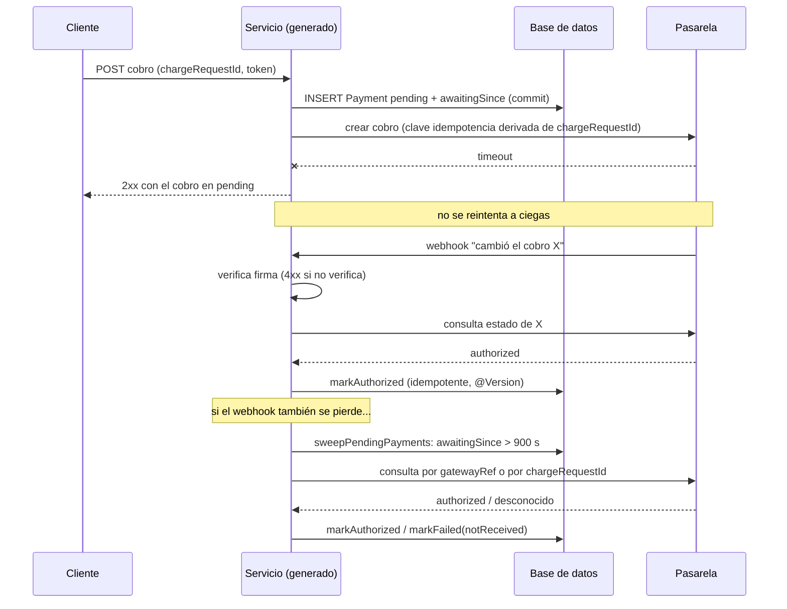

# Pasarelas de pago: guía para desarrolladores backend (y cómo las opera Keel)

> **Objetivo.** Entender cómo funciona un cobro de punta a punta (actores, estados, métodos, autenticación, fallos) con la profundidad que necesita quien escribe el servidor, y después leer la capa `payments` de Keel (DSL 2.19) sabiendo **qué problema resuelve cada campo**, para poder diseñarla, validarla y generarla con criterio.
>
> **Cómo leerla.** La Parte I es conocimiento general de la industria. La Parte II es Keel. Si ya conoces el dominio, salta a la sección 7 (fiabilidad), que es donde se decide casi todo el diseño de Keel.

---

## Índice

**Parte I — Cómo funcionan las pasarelas de pago**

1. [Los actores y el viaje del dinero](#1-los-actores-y-el-viaje-del-dinero)
2. [Tokenización y PCI DSS: por qué tu backend nunca ve una tarjeta](#2-tokenización-y-pci-dss-por-qué-tu-backend-nunca-ve-una-tarjeta)
3. [El ciclo de vida de un cobro](#3-el-ciclo-de-vida-de-un-cobro)
4. [Métodos de pago: síncronos y asíncronos](#4-métodos-de-pago-síncronos-y-asíncronos)
5. [Autenticación del cliente: 3DS, SCA y cobros sin el cliente](#5-autenticación-del-cliente-3ds-sca-y-cobros-sin-el-cliente)
6. [Cómo se integra una pasarela](#6-cómo-se-integra-una-pasarela)
7. [Fiabilidad: el problema real de un backend de pagos](#7-fiabilidad-el-problema-real-de-un-backend-de-pagos)
8. [Rechazos y fallos](#8-rechazos-y-fallos)
9. [Lo que suele quedar fuera del primer diseño](#9-lo-que-suele-quedar-fuera-del-primer-diseño)
10. [Stripe frente a MercadoPago](#10-stripe-frente-a-mercadopago)

**Parte II — La solución de Keel**

11. [El principio: el diseño no nombra la pasarela](#11-el-principio-el-diseño-no-nombra-la-pasarela)
12. [La capa `payments` campo a campo](#12-la-capa-payments-campo-a-campo)
13. [Mapa: concepto de la industria → pieza de Keel](#13-mapa-concepto-de-la-industria--pieza-de-keel)
14. [El cobro en diagramas](#14-el-cobro-en-diagramas)
15. [La matriz de paridad y cómo elegir capacidades](#15-la-matriz-de-paridad-y-cómo-elegir-capacidades)
16. [Operar la capa como diseñador](#16-operar-la-capa-como-diseñador)
17. [Glosario](#17-glosario)

---

# Parte I — Cómo funcionan las pasarelas de pago

## 1. Los actores y el viaje del dinero

Un pago con tarjeta parece una llamada HTTP, pero detrás hay una cadena de cinco o seis organizaciones, cada una con su propio libro contable.

| Actor | Qué es | Ejemplo |
|---|---|---|
| **Titular** (cardholder) | Quien paga | El cliente |
| **Comercio** (merchant) | Quien cobra: **tu servicio** | La tienda |
| **Pasarela / PSP** (Payment Service Provider) | La API con la que habla tu backend. Tokeniza, enruta, antifraude, webhooks | Stripe, MercadoPago, Adyen |
| **Adquirente** (acquirer) | El banco que recibe el dinero en nombre del comercio | A menudo el propio PSP o un banco asociado |
| **Red de tarjetas** (scheme) | El protocolo entre adquirente y emisor | Visa, Mastercard, Amex |
| **Emisor** (issuer) | El banco que emitió la tarjeta y decide si aprueba | El banco del cliente |



Tres ideas que conviene tener desde el principio:

- **Autorizar no es mover dinero.** La autorización es una *reserva* en el crédito del cliente. El dinero se mueve al **capturar**, y llega a la cuenta del comercio días después, en la **liquidación** (*settlement*), descontadas las comisiones (*interchange* del emisor + *scheme fee* de la red + margen del PSP).
- **Agregador frente a cuenta propia.** Stripe y MercadoPago son *agregadores* (o *payment facilitators*): el comercio no necesita contrato con un adquirente, el PSP lo es en su nombre. Con un adquirente directo (típico en empresas grandes) hay más control y menos comisión, pero también más integración.
- **Tu backend solo habla con el PSP.** Todo lo que pasa detrás le llega como **estados y códigos** de la API del PSP. Diseñar un servicio de pagos es, en la práctica, diseñar cómo se refleja en tu base de datos el estado que vive en el PSP.

## 2. Tokenización y PCI DSS: por qué tu backend nunca ve una tarjeta

**PCI DSS** es el estándar de seguridad de la industria de tarjetas. Cualquier sistema que almacene, procese o transmita el número de tarjeta (PAN) entra en su alcance, con auditorías y controles muy caros (el cuestionario SAQ D tiene cientos de requisitos).

La solución universal es la **tokenización en el cliente**:

1. El navegador carga un componente del PSP (Stripe Elements, Card Payment Brick de MercadoPago) servido desde el dominio del PSP, a menudo dentro de un iframe.
2. El cliente escribe la tarjeta **en ese componente**; tu página nunca la toca.
3. El componente devuelve un **token** (o un `payment_method` id) que no sirve para nada fuera del PSP.
4. Tu backend recibe solo el token y lo usa para cobrar.

Con eso el comercio queda en el alcance mínimo (SAQ A). **Regla de diseño:** un campo `cardNumber`, `cvv` o `expiry` en tu modelo es un error de arquitectura, no un detalle.

Dos tipos de referencia opaca que vas a manejar:

| Referencia | Vida | Uso |
|---|---|---|
| **Token de un uso** | Minutos, un cobro | Cliente presente: acaba de escribir la tarjeta |
| **Medio guardado** | Meses o años | Cobrar después sin el cliente (suscripciones, cobro al enviar, recargas) |

El medio guardado tiene un riesgo propio: **es de un titular**. Si tu API acepta «cobra con el medio X» sin comprobar que X pertenece a quien pide el cobro, cualquiera cobra con la tarjeta de otro. La práctica recomendada es no exponer la referencia del PSP, sino un **id propio** que en tu base de datos está atado a su titular.

## 3. El ciclo de vida de un cobro

Las operaciones básicas sobre un cobro con tarjeta:

| Operación | Qué hace | Cuándo |
|---|---|---|
| **Autorizar** (authorize) | Reserva el importe en la tarjeta | Al pedir |
| **Capturar** (capture) | Convierte la reserva en cargo efectivo | Al servir (envío, check-out) |
| **Anular** (void / cancel) | Libera una reserva **no capturada** | El pedido no se sirve |
| **Devolver** (refund) | Devuelve dinero **ya capturado**, total o parcial | Devolución, compensación |

### Dos flujos

- **Un paso** (*single-step*, *sale*, captura automática): autorizar y capturar en el mismo acto. Lo normal en bienes digitales o servicios que se prestan al instante.
- **Autorizar y capturar** (*authorize-capture*, *auth & capture*, captura manual): primero se reserva y después se captura. Lo normal cuando hay un tiempo entre el pedido y la entrega: e-commerce con envío, hoteles, alquiler de coches, marketplaces que esperan a que el vendedor confirme.

¿Por qué no cobrar siempre en un paso y devolver si hace falta? Porque **anular una reserva es gratis y casi instantáneo para el cliente**, mientras que una devolución cuesta comisión, tarda días en aparecer en el extracto y genera disputas.

### La autorización caduca

Una autorización no dura para siempre: en tarjeta, del orden de **días** (Stripe: 7 días en tarjeta no presente; algunos casos de Visa, 4 días y 18 horas). Al caducar, el PSP la cancela solo y la captura falla. Consecuencia para el backend: **la autorización es un estado con reloj**, y tu modelo tiene que poder pasar de `authorized` a `canceled` sin que nadie lo haya pedido.

### Captura y devolución parciales

- **Captura parcial**: capturas menos de lo autorizado (faltó un artículo); el resto se libera. No todas las pasarelas la soportan en todas sus APIs.
- **Devolución parcial**: devuelves una parte. Hay que llevar la cuenta de cuánto se ha devuelto: la suma no puede superar lo capturado.

## 4. Métodos de pago: síncronos y asíncronos

| Familia | Ejemplos | Cómo se confirma | Notas |
|---|---|---|---|
| **Tarjeta** | Crédito, débito, prepago | Casi en tiempo real (segundos) | Admite autorización/captura (sobre todo crédito) |
| **Wallets** | Apple Pay, Google Pay | Como tarjeta | Por debajo es una tarjeta tokenizada por el dispositivo |
| **Transferencia instantánea** | PIX (BR), SPEI (MX), SEPA Instant, Bizum | Segundos a minutos, **iniciada por el cliente** | Sin autorización/captura; no hay «reserva» |
| **Efectivo / voucher** | Boleto (BR), OXXO (MX), Rapipago (AR) | **Días**: el cliente paga en una tienda | El cobro queda `pending` mucho tiempo y puede expirar |
| **Débito directo** | SEPA Direct Debit, ACH | Días | Se puede revertir semanas después |
| **BNPL** | Klarna, Afterpay | Como tarjeta para el comercio | El riesgo lo asume el proveedor |

La distinción que importa al backend es **síncrono frente a asíncrono**:

- En un método **síncrono** (tarjeta), la respuesta de la API ya trae el desenlace casi siempre. Tu estado `pending` dura segundos.
- En un método **asíncrono** (PIX, boleto, débito directo), la respuesta solo dice «esperando al cliente». El desenlace llega **solo por webhook** horas o días después. Tu modelo necesita estados de espera largos, caducidades y una reconciliación que no se rinda pronto.

Diseñar para tarjeta y añadir boleto después no es «otro método»: es otro modelo de estados. Por eso tiene sentido empezar acotando el alcance.

## 5. Autenticación del cliente: 3DS, SCA y cobros sin el cliente

### 3-D Secure 2 y SCA

**3-D Secure** (3DS) es el protocolo por el que el emisor puede pedir al cliente que demuestre que es él (SMS, app del banco, biometría). En Europa la normativa **PSD2** lo hace casi obligatorio con el nombre de **SCA** (*Strong Customer Authentication*); en Latinoamérica y otras regiones depende del emisor y del riesgo.

Dos variantes:

- **Frictionless**: el emisor evalúa el riesgo con los datos del dispositivo y aprueba sin pedir nada al cliente.
- **Challenge**: el emisor exige interacción. El cobro **se para** en un estado intermedio (`requires_action` en Stripe) con una **acción** que el frontend tiene que ejecutar (abrir un modal, redirigir). Cuando el cliente la completa, el cobro sigue su curso.

Para el backend esto significa un estado más, **`actionRequired`**, y un dato opaco (la acción) que hay que hacer llegar al frontend. El formato de ese dato es propio de cada PSP: **el servidor puede ser portable, el frontend no**.

### Cliente presente y cliente ausente

| | Cliente presente (*on-session*, CIT) | Cliente ausente (*off-session*, MIT) |
|---|---|---|
| Quién inicia | El cliente, en tu web o app | Tu sistema (suscripción, cobro al enviar, recarga) |
| Con qué se paga | Token de un uso | **Medio guardado** |
| 3DS | Se resuelve en el momento | No hay nadie para resolverlo |

CIT y MIT significan *Customer-Initiated* y *Merchant-Initiated Transaction*. Un MIT necesita que antes hubiera un CIT en el que el cliente **consintió** guardar el medio. Cada PSP lo modela distinto:

- **Stripe**: un `SetupIntent` (o `setup_future_usage` en el primer cobro) deja un `customer` + `payment_method`; después se cobra con `off_session=true`.
- **MercadoPago (Orders)**: el primer cobro con `stored_credential` crea un `payment_profile`; los siguientes se cobran con `customer_id` + `payment_profile_id`, sin CVV ni token nuevo.

¿Y si el emisor exige autenticación en un cobro sin el cliente delante? El cobro no puede completarse: queda en `actionRequired` y **tu negocio decide** si avisa al cliente para que vuelva a completarlo.

## 6. Cómo se integra una pasarela

### Modelos de integración

| Modelo | Qué hace tu backend | PCI | Control |
|---|---|---|---|
| **Checkout hospedado** (Stripe Checkout, Checkout Pro) | Crea una sesión y redirige | Mínimo | Bajo |
| **Componente embebido + API** (Elements, Bricks) | Recibe el token y crea el cobro por API | Mínimo (SAQ A) | Alto |
| **API directa con PAN** | Recibe la tarjeta | Máximo (SAQ D) | Total |

El modelo habitual en un backend propio es el segundo, y es el que asume Keel.

### El objeto «cobro» en cada API

Cada PSP tiene su objeto central, con su propia máquina de estados:

- **Stripe → `PaymentIntent`**: `requires_payment_method` → `requires_confirmation` → `requires_action` → `processing` → `requires_capture` → `succeeded` | `canceled`.
- **MercadoPago → `Order`** (API nueva, la única con cobro off-session) o `Payment` (API clásica): estados propios como `processed`, `action_required`, `canceled`, `refunded`…

No intentes que tu dominio herede los estados de un PSP. Lo sano es un **modelo propio de estados** y un **adaptador** que traduzca. Es exactamente lo que hace Keel.

### El importe

- **Nunca uses `float`/`double`** para dinero. En Java, `BigDecimal`; en base de datos, `numeric(p, s)`.
- Cada PSP pide el importe en una unidad: Stripe en **unidades menores** como entero (`1099` = 10,99 USD); MercadoPago en **unidades mayores** como decimal (`10.99`).
- La **escala depende de la moneda**: JPY tiene 0 decimales, USD 2, KWD 3. Convertir `12.50` a céntimos sin conocer la moneda es un bug esperando a pasar.
- El importe que se cobra **lo calcula el servidor**, nunca se toma tal cual de lo que manda el navegador.

### Credenciales

Dos secretos por PSP: la clave de la API (para llamar) y el **secreto del webhook** (para verificar los avisos). Son datos de despliegue, no de código, y el del webhook se **rota** (Stripe admite dos activos durante la rotación).

## 7. Fiabilidad: el problema real de un backend de pagos

Aquí está la parte difícil. Cobrar cuando todo va bien es una llamada HTTP. Lo que hace un buen servicio de pagos es **no cobrar dos veces ni perder un cobro cuando algo falla**. Y algo siempre falla.

### 7.1 La respuesta perdida

```
Tu backend ──POST /cobro──▶ PSP     (el PSP cobra)
Tu backend ◀──── timeout ──── PSP   (la respuesta no llega)
```

¿Se cobró o no? No lo sabes. Las dos reacciones ingenuas son malas:

- **Reintentar a ciegas** → doble cargo si el primero sí entró.
- **Darlo por fallido** → el cliente pagó y tú no le das el producto.

La respuesta correcta es: **el cobro queda «en duda» y se pregunta al PSP** cuál es su estado.

### 7.2 Claves de idempotencia… y sus límites

Los PSP admiten una cabecera de idempotencia (`Idempotency-Key` en Stripe, `X-Idempotency-Key` en MercadoPago): si repites la petición con la misma clave, el PSP devuelve el resultado de la primera en vez de ejecutarla otra vez. Ayuda mucho, pero **no es una garantía permanente**:

- **Guarda también los errores.** Si la primera petición devolvió un 500, repetirla con la misma clave devuelve el mismo 500.
- **Caduca.** Stripe puede purgar las claves pasadas 24 h. Un reintento tardío con la misma clave puede cobrar otra vez.
- **Misma clave con distintos parámetros** devuelve error.

La guarda que no caduca está **en tu base de datos**: una restricción de unicidad sobre la **clave de negocio del cobro** (el id de la petición de cobro, o el id del pedido). Dos peticiones de cobro del mismo pedido no pueden crear dos registros. La clave de idempotencia hacia el PSP se **deriva** de esa misma clave de negocio, para que reintentos y caminos distintos converjan en la misma clave también al otro lado.

### 7.3 Registrar antes de llamar

El orden de operaciones que evita perder cobros:

1. **Insertar** el registro del cobro en `pending`, con la marca de tiempo «esperando desde», y **confirmar la transacción**.
2. **Llamar** al PSP, fuera de la transacción.
3. Aplicar la respuesta en otra transacción.

Si llamas al PSP dentro de la transacción y esta hace rollback después de que el PSP cobró, has cobrado algo de lo que tu base de datos no sabe nada. (Este error lo cometió el propio generador de Keel y salió en las corridas: hallazgo F1, ya corregido.)

### 7.4 Webhooks

El PSP avisa por HTTP cuando algo cambia (autorizado, capturado, reembolsado, 3DS completado…). Propiedades que tienes que asumir:

- **Pueden llegar repetidos**, **desordenados** y **tarde** (Stripe reintenta hasta 3 días).
- **Pueden ser falsos** si no verificas la firma. La firma es un HMAC-SHA256 con un secreto compartido; se compara en **tiempo constante** y con **tolerancia de tiempo** contra *replay* (5 minutos es lo habitual).
- **La firma no siempre cubre el contenido.** En Stripe se firma `"{timestamp}.{cuerpo crudo}"`; en MercadoPago solo un manifiesto con el id, el request-id y el timestamp. Con MercadoPago, quien altere el cuerpo en tránsito podría decidir el estado del cobro si lo tomas del cuerpo.
- **Responde 2xx rápido** y procesa después; si tardas, el PSP lo da por fallido y reintenta.

El patrón robusto, que resuelve los cuatro problemas a la vez:

> **El aviso solo dice «algo cambió en el cobro X». El estado se consulta al PSP.**

Consultar en vez de aplicar el evento neutraliza el desorden (siempre lees el estado actual), los duplicados (aplicar el mismo estado dos veces no hace nada) y los avisos manipulados (el contenido del aviso no decide nada). Y un aviso cuya firma **no verifica** se rechaza con un 4xx sin consultar nada: si se consultara igual, un aviso falso y uno verdadero acabarían en el mismo sitio y la verificación no serviría de nada.

### 7.5 Reconciliación

Webhooks y respuestas se pierden. La red de seguridad es un **barrido periódico**: un job que busca los cobros que llevan más de N minutos esperando un desenlace y le pregunta al PSP por cada uno. Si el PSP no conoce el cobro (la petición no llegó nunca), se da por fallido.

La reconciliación no es una precaución opcional: es **lo único que resuelve una acción cuya respuesta no llegó** sin arriesgar un doble cargo.

### 7.6 El estado en vuelo

Capturar, anular y devolver también son llamadas al PSP, y su respuesta también se puede perder. La técnica es la misma que con el cobro: antes de llamar, mover el registro a un **estado en vuelo** (`capturing`, `canceling`, `refunding`) y confirmar. Eso da tres cosas:

- **Reconciliable**: si la respuesta no llega, el barrido ve un cobro en `capturing` y pregunta.
- **Excluyente**: una captura y una anulación simultáneas no llegan las dos al PSP; la segunda encuentra el cobro ya en vuelo.
- **Observable**: quien consulta ve que hay una acción en curso.

### 7.7 Tres caminos, un desenlace

El mismo desenlace puede llegar por tres caminos: la **respuesta síncrona**, el **webhook** y el **barrido**. La aplicación del desenlace tiene que ser **idempotente** (si el cobro ya no está en el estado de origen, no hacer nada y no fallar) y estar protegida por **bloqueo optimista** (`@Version`) para que dos desenlaces *distintos* no se pisen.

### 7.8 Avisar al resto del sistema

Si otros servicios tienen que enterarse del desenlace (pedidos, facturación), el evento se publica con un **outbox transaccional**: se escribe en la misma transacción que cambia el estado del cobro y un relay lo publica después. Así no hay cobro capturado sin evento, ni evento sin cobro capturado.

## 8. Rechazos y fallos

Cada PSP devuelve sus propios códigos (`card_declined` + `decline_code: insufficient_funds` en Stripe; `cc_rejected_insufficient_amount` en MercadoPago; decenas de valores). Buenas prácticas:

- **Normaliza a un vocabulario propio y cerrado.** Si guardas el texto del PSP, el mismo diseño se comporta distinto según el PSP, y tu negocio (reintentos, mensajes al cliente, métricas) queda acoplado a él.
- **Distingue rechazo «blando» de «duro».** Blando (fondos insuficientes, error de procesamiento) puede reintentarse más tarde con otro intento; duro (tarjeta robada, caducada, fraude) no.
- **No le cuentes al cliente que es fraude.** El motivo detallado es para ti; al cliente, un mensaje genérico.
- **Separa el error del medio del error de la infraestructura.** «Tarjeta rechazada» es un desenlace del cobro; «el PSP devolvió 503» es un cobro en duda que resuelve la reconciliación.

## 9. Lo que suele quedar fuera del primer diseño

| Tema | Qué es | Por qué complica |
|---|---|---|
| **Disputas / contracargos** | El cliente reclama al banco y el dinero se retira al comercio | Flujo de evidencias con plazos, semanas después |
| **Suscripciones** | Cobros recurrentes con calendario, prorrateo, reintentos (*dunning*) | Es un producto en sí (Stripe Billing) |
| **Payouts / split** | Repartir el dinero entre vendedores (marketplaces) | KYC, cuentas conectadas, regulación |
| **Multimoneda / FX** | Cobrar en una moneda y liquidar en otra | Tipos de cambio, redondeos |
| **Antifraude** | Reglas y modelos de riesgo (Stripe Radar) | Suele venir del PSP; se configura, no se programa |
| **Métodos asíncronos** | PIX, boleto | Otro modelo de estados (sección 4) |

Keel deja fuera hoy exactamente estos temas (ver sección 12), y lo hace a propósito.

## 10. Stripe frente a MercadoPago

Resumen del contraste de contratos reales que Keel hizo antes de escribir la capa (`docs/pasarelas/fase0-contratos-stripe-mercadopago.md`, verificado el 2026-10-02):

| Eje | Stripe | MercadoPago (API de Orders) |
|---|---|---|
| Objeto del cobro | `PaymentIntent` | `Order` |
| Autorizar/capturar | `capture_method=manual` → `requires_capture` → `/capture` | `capture_mode: manual` (solo tarjeta de crédito) |
| Captura parcial | Sí (`amount_to_capture`) | En Orders, **no documentada** |
| Validez de la autorización | 7 días | A verificar |
| Devolución parcial | Sí | Sí |
| Idempotencia | `Idempotency-Key`; guarda los 500; purga a las 24 h | `X-Idempotency-Key` |
| Importe | Entero en unidades menores (`1099`) | Decimal en unidades mayores (`10.99`) |
| Cobro off-session | `customer` + `payment_method` + `off_session=true` | `customer_id` + `payment_profile_id` |
| 3DS | `next_action` + `client_secret` | Propio de Orders (forma a verificar) |
| Firma del webhook | `Stripe-Signature: t=…,v1=…` sobre `"{t}.{cuerpo}"` | `x-signature: ts=…,v1=…` sobre manifiesto `id;request-id;ts` |
| ¿La firma cubre el cuerpo? | **Sí** | **No** |
| Contenido del webhook | Objeto completo (*snapshot*) | Solo el id (*thin*) |
| Secretos | `STRIPE_SECRET_KEY`, `STRIPE_WEBHOOK_SECRET` | `MERCADOPAGO_ACCESS_TOKEN`, `MERCADOPAGO_WEBHOOK_SECRET` |

Dos conclusiones de esta tabla definieron la capa de Keel: **el desenlace siempre se consulta** (con MercadoPago es obligatorio, y hacerlo igual en Stripe unifica el camino), y **la idempotencia del PSP no basta contra el doble cargo** (de ahí la unicidad propia y la reconciliación obligatoria).

---

# Parte II — La solución de Keel

## 11. El principio: el diseño no nombra la pasarela

La capa `payments` (archivo `specs/<servicio>/payments.keel.yaml`, DSL 2.19) es opcional y aplica la promesa del método al dinero: **un único diseño, y lo que cambia entre pasarelas lo pone el generador**. La pasarela se elige al generar, igual que el broker o la base de datos: está en `keel-stack.json` (clave `paymentGateway`) y la pregunta `keel-spring build` en su cuestionario.

| Lo decides tú en el diseño | Lo pone el generador (cambia por pasarela) |
|---|---|
| Cuándo se considera cobrado (`flow`) | El contrato HTTP de la pasarela |
| Qué se le exige a la pasarela (`capabilities`) | La firma del aviso y cómo se verifica |
| Qué operación ejecuta cada acción y de qué campos salen sus datos | La unidad del importe y la escala de cada moneda |
| Quién registra cada desenlace (`outcomes`) | La cabecera de idempotencia y cómo se deriva la clave |
| Qué estado marca cada acción en curso (`inFlight`) | Cómo se guarda un medio de pago (SetupIntent, primer cobro marcado…) |
| Cuánto silencio se tolera antes de consultar (`reconciliation`) | La traducción de sus códigos de rechazo al vocabulario neutro |

**Regla práctica:** si sientes la necesidad de escribir «Stripe» o «MercadoPago» en una `description` o en una regla del dominio para que el diseño funcione, has encontrado un hueco de la capa. No lo resuelvas en prosa: repórtalo.

Dos cosas que la capa **no** es:

- No es un `http-clients`: el cliente HTTP de la pasarela lo genera el generador; no se declara.
- No es una `dependency`: una pasarela no es otro servicio Keel.

## 12. La capa `payments` campo a campo

El ejemplo es la fixture `payment-checkout` (en `keel-spring/test/fixtures/`), la que se usó en las dos corridas de octubre: cobra pedidos autorizando al pedirlos y capturando al servirlos.

```yaml
description: Cobra con tarjeta los pedidos, autorizando al pedirlos y capturando al servirlos.
flow: authorize-capture
capabilities: [partial-refund, customer-action, off-session]

record:
  entity: Payment
  gatewayRef: gatewayPaymentId
  awaitingSince: awaitingSince
  failureReason: failureReason
  customerAction: customerAction

charge:
  operation: requestCharge
  reference: chargeRequestId
  amount: amount
  currency: { parameter: currency }
  source:
    token: paymentToken
    saved: paymentMethodRef

capture: { operation: capturePayment, inFlight: capturing }
void: { operation: cancelPayment, inFlight: canceling }
refund: { operation: refundPayment, amount: amount, inFlight: refunding }
savePaymentMethod: { operation: savePaymentMethod, token: paymentToken, exposedAs: id }

outcomes:
  authorized: markAuthorized
  actionRequired: markActionRequired
  captured: markCaptured
  failed: markFailed
  refunded: markRefunded
  canceled: markCanceled

reconciliation:
  sweep: sweepPendingPayments
  unansweredAfterSeconds: 900
```

Fíjate en que la capa **no define nada nuevo**: casi todo son **referencias por nombre** a cosas que ya existen en otras capas (la entidad `Payment` en `domain`, las operaciones en `use-cases`, el parámetro `currency` en `service`). La capa es el **pegamento** que le dice al generador qué papel cumple cada pieza en un cobro.

### `flow` — cuándo está cobrado

- `authorize-capture` (sección 3): exige `capture`, `outcomes.authorized` y `outcomes.canceled` (la autorización caduca y la pasarela la cancela sola).
- `single-step`: no admite `capture` ni `outcomes.authorized`.

La fixture explica su elección en un comentario: *«el cliente no paga un pedido que no se le sirve, y anular una retención no cuesta lo que cuesta una devolución»*. Es buena práctica dejar escrito el porqué.

### `capabilities` — qué le exiges a la pasarela

| Capacidad | Pieza que la usa |
|---|---|
| `partial-capture` | `capture.amount` |
| `partial-refund` | `refund.amount` |
| `customer-action` | `record.customerAction` y `outcomes.actionRequired` (3DS) |
| `off-session` | `savePaymentMethod` y `charge.source.saved` (MIT) |

La relación va en los dos sentidos (`CHK-PAYMENTS-CAPABILITY-UNBACKED`): una capacidad sin su pieza estrecha sin motivo las pasarelas que te sirven, y una pieza sin su capacidad generaría algo que alguna pasarela no cubre. La fixture **no** declara `partial-capture` a propósito: MercadoPago no la tiene documentada en Orders y el servicio siempre captura el pedido entero; lo parcial va por la devolución.

### `record` — la memoria del cobro

La entidad del dominio en la que se refleja el estado del PSP (sección 6: modelo propio, no heredado):

- **`gatewayRef`** (string): el id que asigna la pasarela. Vacío mientras no ha contestado; entonces el cobro se consulta por su `charge.reference`, que el generador manda como referencia externa. Por eso un cobro sin respuesta **sigue siendo reconciliable** (sección 7.1).
- **`awaitingSince`** (timestamp): desde cuándo espera desenlace. Se estampa al nacer en `pending` y al entrar en cada estado en vuelo. **Es el único reloj que mira el barrido.**
- **`failureReason`**: enum del dominio con **exactamente** el vocabulario neutro (`CHK-PAYMENTS-FAILURE-VOCABULARY`; la lista la define `FAILURE_REASONS` en `keel-core`):

  | Valor | Cuándo |
  |---|---|
  | `declined` | el emisor rechazó sin motivo útil |
  | `insufficientFunds` | sin fondos o sin crédito |
  | `expiredCard` | la tarjeta caducó |
  | `authenticationFailed` | el cliente no completó la autenticación o la falló |
  | `fraudSuspected` | lo paró el antifraude |
  | `invalidPaymentMethod` | token inválido o caducado, medio retirado o de otro titular |
  | `notReceived` | la pasarela no conoce el cobro: la petición no llegó nunca |
  | `processingError` | fallo de la pasarela o de la red, no del medio |

  Es la normalización de la sección 8 hecha contrato. La lista es cerrada: un motivo nuevo es un cambio del DSL, no de un adaptador.
- **`customerAction`** (string o json; exige `customer-action`): la acción 3DS, opaca, guardada **solo mientras el cobro está en `actionRequired`**. Sale en la lectura del cobro y conviene que viaje en el evento del desenlace, para recuperarla cuando el cobro se pidió sin el cliente delante.

En la fixture, `Payment` tiene además lo que pide el negocio (`orderId`, `payerId`, `refundedAmount`, `savedPaymentMethodId`) y un **lifecycle** que es la máquina de estados completa (sección 14).

### `charge` — el cobro

- **`operation`**: la operación de `use-cases` que pide el cobro.
- **`reference`**: la **clave de negocio** del cobro (`chargeRequestId`). Es **la** guarda contra el doble cargo (sección 7.2), y por eso tiene que ser miembro de la `naturalKey` de la entidad o `unique` en el dominio (`CHK-PAYMENTS-REFERENCE-UNGUARDED`). De ella deriva el generador la clave de idempotencia hacia la pasarela y la referencia externa con la que se consulta un cobro sin `gatewayRef`.
- **`amount`**: campo `decimal` en **unidades mayores** (12.50). La conversión a la unidad de cada pasarela es del generador (`amountUnit: minor` en Stripe, `major` en MercadoPago).
- **`currency`**: de un campo del input (`{ input: currency }`) o de un **parámetro de despliegue** (`{ parameter: currency }`, de `service.parameters`) cuando el servicio opera en una sola moneda.
- **`source`**: con qué se paga, siempre como referencia opaca (sección 2):
  - `token`: el del componente del navegador (cliente presente);
  - `saved`: un medio guardado (cliente ausente, exige `off-session`). Puede ser la referencia opaca del PSP (`string`) o el **id de un registro propio** (`uuid`). Lo recomendable es lo segundo, y la fixture lo hace con la entidad `SavedPaymentMethod` (con `payerId` y `gatewayReference` marcada `sensitive`, que nunca sale del servicio): eso permite comprobar que el medio es de quien paga (`REV-PAYMENTS-SAVED-OWNERSHIP`).

Lo que el generador hace con esto, sin que lo escribas: **registra el cobro en `pending` antes de llamar** (sección 7.3) y, si la respuesta no llega, **no reintenta a ciegas**: lo deja al barrido.

#### Dos puertas sobre el mismo cobro

La operación de `charge` puede tener endpoint HTTP **y** suscripción a un evento a la vez (en la fixture, el sistema de pedidos puede pedir el cobro por evento `ChargeRequested`). Reglas:

- **Por evento no hay cliente presente** → solo se puede cobrar un medio guardado → la capa tiene que declarar `off-session` (`CHK-PAYMENTS-ASYNC-NEEDS-OFF-SESSION`).
- **Quien pide por evento no recibe respuesta HTTP** → se entera por los eventos que publican las operaciones de `outcomes` (`CHK-PAYMENTS-OUTCOME-SILENT`). Un rechazo de negocio por esa puerta conviene registrarlo como cobro `failed` con su motivo; si solo se descarta, quien pidió no se entera nunca.
- **La deduplicación entre puertas** la da la `naturalKey` sobre `reference`. Si además declaras `idempotency` en la operación, que sea `keySource: payload-field` sobre ese mismo campo (`client-key` no llega por el broker).

### Acciones de seguimiento e `inFlight`

`capture`, `void` y `refund` declaran la operación y su **estado en vuelo** (sección 7.6), que tiene que existir en el lifecycle (`CHK-PAYMENTS-INFLIGHT-INVALID`):

- **`capture`**: obligatoria con `authorize-capture`. Con `amount`, captura parcial (exige `partial-capture`).
- **`void`**: anula una autorización. Exige `outcomes.canceled`.
- **`refund`**: devuelve. Con `amount`, parcial (exige `partial-refund`). Exige `outcomes.refunded`.
- **`savePaymentMethod`**: guarda un medio para cobrar sin el cliente. Es **una operación propia y no un efecto lateral del cobro**, porque cada pasarela lo hace distinto (SetupIntent frente a primer cobro con `stored_credential`). `exposedAs` es el campo de la respuesta con el que sale la referencia; es lo que después llega a `charge.source.saved`.

Si la pasarela **rechaza** una acción (autorización caducada, devolución mayor de lo cobrado), el cobro vuelve al estado del que salió o pasa al desenlace que corresponda, y la operación responde con su error declarado. Mira el lifecycle de la fixture: `capturing: [captured, authorized, canceled]`. Las tres salidas son *capturó*, *rechazó, sigue autorizado* y *la autorización había caducado*.

### `outcomes` — quién registra cada desenlace

Cada desenlace lo aplica **una operación propia** que el generador dispara cuando lo conoce, venga por la respuesta, por el webhook o por el barrido (sección 7.7). La capa declara **desenlaces, no webhooks**: el webhook es un detalle de la pasarela y siempre se traduce en «consultar y aplicar el desenlace» (sección 7.4).

Reglas que el validador comprueba:

| Regla | Id |
|---|---|
| `captured` y `failed` siempre; `authorized` con `authorize-capture`; `actionRequired` con `customer-action`; `refunded` con `refund`; `canceled` con `void` o `authorize-capture` | `CHK-PAYMENTS-OUTCOME-MISSING` |
| Tienen que ser `internal: true`: sin puerta propia. Si no, un cliente podría marcar un cobro como pagado sin que la pasarela haya dicho nada | `CHK-PAYMENTS-OUTCOME-EXPOSED` |
| Tienen que mover el lifecycle del registro, o el barrido vuelve a encontrar el cobro esperando | `CHK-PAYMENTS-OUTCOME-NO-TRANSITION` |
| Reciben **solo** lo que la capa nombra (referencia, id de la pasarela, motivo, acción, importe devuelto): por el webhook o el barrido no hay otro dato del que tirar | `CHK-PAYMENTS-OUTCOME-INPUT-UNBACKED` |

Y una que no es un id pero sí contrato: **son idempotentes**. Un desenlace repetido o tardío (el cobro ya no está en el estado de origen) no hace nada y no es un error; el bloqueo optimista solo arbitra que dos desenlaces **distintos** no se pisen.

### `reconciliation` — obligatoria

`sweep` es una operación con `schedule` (`CHK-PAYMENTS-SWEEP-INVALID`) que consulta todo lo que lleva más de `unansweredAfterSeconds` esperando según `awaitingSince`: cobros en `pending`, en `actionRequired` y en cada estado en vuelo. Aplica el desenlace con su operación de `outcomes`; un cobro que la pasarela no conoce pasa a `failed` con `notReceived`.

Es **obligatoria en el schema**, no una obligación que se pueda aceptar por escrito, por lo visto en la sección 7: sin barrido, una respuesta perdida no tiene forma segura de resolverse.

Elegir `unansweredAfterSeconds`: lo bastante largo para no consultar cobros que siguen su curso normal (un 3DS puede tardar minutos), lo bastante corto para que un cobro en duda no bloquee el negocio. La fixture usa 900 s (15 min).

### Lo que no entra (todavía)

El nombre de la pasarela, sus credenciales y URLs (son despliegue); los métodos asíncronos (PIX, boleto); disputas y contracargos; recurrentes y payouts. Cada uno entrará cuando un diseño lo necesite **y su forma se haya contrastado con más de una pasarela**, porque una capa escrita mirando una sola acaba con la forma de esa pasarela.

## 13. Mapa: concepto de la industria → pieza de Keel

| Concepto (Parte I) | Dónde vive en Keel | Quién lo resuelve |
|---|---|---|
| Autorizar / capturar / un paso | `flow` | Diseño |
| Captura y devolución parcial | `capabilities` + `capture.amount` / `refund.amount` | Diseño; matriz de paridad |
| Tokenización, PCI | `charge.source.token` (opaco); `REV-PAYMENTS-CARD-DATA` | Diseño + revisión |
| Medio guardado, MIT | `off-session` + `savePaymentMethod` + `charge.source.saved` | Diseño; cómo se guarda, generador |
| Propiedad del medio guardado | Entidad propia con `payerId`; `REV-PAYMENTS-SAVED-OWNERSHIP` | Diseño + revisión |
| 3DS / SCA / `requires_action` | `customer-action` + `record.customerAction` + `outcomes.actionRequired` | Diseño; formato de la acción, pasarela/frontend |
| Importe en unidades menores, escala por moneda | `charge.amount` (decimal) + `currency` | Generador |
| Importe calculado en el servidor | `REV-PAYMENTS-AMOUNT-SOURCE` | Revisión |
| Clave de idempotencia hacia el PSP | Derivada de `charge.reference` | Generador |
| Guarda permanente contra doble cargo | `naturalKey` sobre `charge.reference` (`CHK-PAYMENTS-REFERENCE-UNGUARDED`) | Diseño |
| Registrar antes de llamar | Comportamiento fijo del cobro | Generador |
| Webhook + verificación de firma | Verificador por pasarela; la capa solo declara `outcomes` | Generador |
| «El aviso avisa, el estado se consulta» | Contrato fijo de la capa | Generador |
| Estado en vuelo | `inFlight` en cada acción | Diseño |
| Desenlace idempotente + bloqueo optimista | `outcomes` (internal, mueven el lifecycle) | Diseño + generador |
| Reconciliación | `reconciliation` + `record.awaitingSince` | Diseño (obligatorio) |
| Normalización de rechazos | `record.failureReason` con `FAILURE_REASONS` | Diseño (enum) + adaptador (traducción) |
| Outbox para avisar a otros servicios | Eventos publicados por las operaciones de `outcomes` | Diseño (`messaging`) + generador |
| Credenciales y secretos | `STRIPE_*` / `MERCADOPAGO_*` en el despliegue | Generador |

## 14. El cobro en diagramas

### Máquina de estados (lifecycle de `Payment` en la fixture)



Lo que estampa `awaitingSince` y por tanto mira el barrido: `pending`, `actionRequired`, `capturing`, `canceling` y `refunding`.

### Secuencia: respuesta perdida y reconciliación



## 15. La matriz de paridad y cómo elegir capacidades

`keel-spring/src/lib/gateway-support.js` cruza lo que exige el diseño (`flow` + `capabilities`) con lo que cubre cada pasarela. Cada celda tiene uno de tres estados:

- **`supported`**: la pasarela lo hace y el contrato está contrastado con su documentación.
- **`unsupported`**: no lo hace, o no hay forma verificada. **`build` se niega** a generar.
- **`unverified`**: la documentación dice que sí, pero algo del contrato no está claro. `build` **genera y avisa** nombrando lo que falta. Pasa a `supported` solo cuando una prueba lo ejecuta contra el sandbox real, nunca porque alguien lo dé por bueno leyendo.

| Requisito | Stripe | MercadoPago |
|---|---|---|
| `flow: authorize-capture` | supported | supported (solo crédito) |
| `flow: single-step` | supported | supported |
| `partial-capture` | supported | **unsupported** |
| `partial-refund` | supported | supported |
| `customer-action` | supported | **unverified** (forma de la acción) |
| `off-session` | supported | **unverified** (respuesta ante 3DS sin cliente, países) |

Por qué existe: generar con una pasarela que no puede cumplir algo es un servidor que **acepta una devolución parcial y devuelve el importe entero, en silencio**. Mejor no generar.

**Cómo elegir capacidades como diseñador:**

1. **Declara solo lo que el negocio necesita.** Cada capacidad reduce el conjunto de pasarelas que sirven el diseño.
2. **Busca alternativas de forma.** ¿Necesitas captura parcial, o te basta capturar entero y devolver la diferencia? La fixture eligió lo segundo y así sirve con las dos pasarelas.
3. **Comprueba antes de cerrar:** `keel-spring check specs/<servicio>` contrasta el diseño contra **todas** las pasarelas del catálogo; con `--payment-gateway=<pasarela>`, solo contra una.
4. **Un `unverified` no es un no**, pero es deuda: hasta verificarlo en el sandbox, lo que hace el adaptador en ese caso es una suposición documentada.

## 16. Operar la capa como diseñador

### El recorrido

```bash
# 1. Diseñar: /keel-design en el workspace. Además de payments.keel.yaml, el diseño necesita
#    en domain: la entidad del registro con su lifecycle, el enum de failureReason y la naturalKey
#    en use-cases: requestCharge, capture/cancel/refund, los mark* (internal) y el sweep (schedule)
#    en service: el parámetro currency si es moneda única
#    en messaging: los eventos de desenlace si alguien más tiene que enterarse

keel validate specs/<servicio>          # schema + CHK-PAYMENTS-*
keel validate specs/<servicio> --ready  # incluye revisión (REV-PAYMENTS-*) y análisis de huecos

keel-spring check specs/<servicio>                            # ¿qué pasarelas lo sirven?
keel-spring check specs/<servicio> --payment-gateway=stripe   # solo una

keel-spring build specs/<servicio>      # el cuestionario pregunta la pasarela (queda en keel-stack.json)
cd services/<servicio>-spring
/keel-generate-spring
```

Para cambiar de pasarela no se toca el diseño: se cambia `paymentGateway` en `keel-stack.json` y se regenera. Es exactamente lo que midieron las corridas del 2026-10-02: el mismo `specs/` byte a byte, una con Stripe y otra con MercadoPago, **25/25 escenarios en las dos** y la misma huella del agente archivo por archivo (30 reescritos, ninguno del adaptador ni del verificador de la pasarela).

### Checklist del diseño

**Registro y dominio**
- [ ] La entidad de `record` tiene un `lifecycle` con todos los estados: `pending`, los de desenlace y uno en vuelo por cada acción.
- [ ] `charge.reference` está en la `naturalKey` (o es `unique`). Es tu guarda contra el doble cargo.
- [ ] `failureReason` es un enum con **exactamente** los ocho valores neutros.
- [ ] `awaitingSince` es un `timestamp`; `gatewayRef` un `string` con longitud suficiente.
- [ ] No hay ningún campo con datos de tarjeta (`REV-PAYMENTS-CARD-DATA`).

**Cobro**
- [ ] El importe lo calcula el servidor a partir de algo que controla (el pedido), no lo manda el cliente sin más (`REV-PAYMENTS-AMOUNT-SOURCE`).
- [ ] Si hay `source.saved`, el medio es un registro propio atado a su titular y se comprueba que es del pagador (`REV-PAYMENTS-SAVED-OWNERSHIP`).
- [ ] Si el cobro se puede pedir por evento: `off-session` declarado y eventos de desenlace publicados.

**Desenlaces y barrido**
- [ ] Todas las operaciones de `outcomes` son `internal: true` y mueven el lifecycle.
- [ ] Sus inputs se limitan a lo que la capa nombra.
- [ ] El `sweep` tiene `schedule` y un `unansweredAfterSeconds` razonado.

**Capacidades**
- [ ] Cada capacidad tiene su pieza y cada pieza su capacidad.
- [ ] `keel-spring check` dice que el diseño se genera con las pasarelas que te interesan.

### Las reglas mecánicas, de un vistazo

| Id | Qué caza |
|---|---|
| `CHK-PAYMENTS-OP-UNKNOWN` | Una operación nombrada en la capa que no existe en `use-cases` |
| `CHK-PAYMENTS-RECORD-UNKNOWN` | Un campo de `record` que no existe en la entidad o tiene otro tipo |
| `CHK-PAYMENTS-FIELD-UNKNOWN` | Un campo de `charge`/acciones que no está en el input de la operación |
| `CHK-PAYMENTS-FLOW-MISMATCH` | Piezas incompatibles con el `flow` |
| `CHK-PAYMENTS-CAPABILITY-UNBACKED` | Capacidad sin pieza o pieza sin capacidad |
| `CHK-PAYMENTS-REFERENCE-UNGUARDED` | `charge.reference` fuera de la clave natural |
| `CHK-PAYMENTS-FAILURE-VOCABULARY` | El enum de `failureReason` no coincide con el vocabulario neutro |
| `CHK-PAYMENTS-INFLIGHT-INVALID` | Un `inFlight` que no es un estado del lifecycle |
| `CHK-PAYMENTS-OUTCOME-MISSING` | Falta un desenlace obligatorio |
| `CHK-PAYMENTS-OUTCOME-EXPOSED` | Un desenlace con puerta pública |
| `CHK-PAYMENTS-OUTCOME-NO-TRANSITION` | Un desenlace que no mueve el lifecycle |
| `CHK-PAYMENTS-OUTCOME-INPUT-UNBACKED` | Un desenlace que pide datos que no tienen de dónde salir |
| `CHK-PAYMENTS-OUTCOME-SILENT` | Cobro pedido por evento sin que los desenlaces publiquen nada |
| `CHK-PAYMENTS-ASYNC-NEEDS-OFF-SESSION` | Cobro por evento sin `off-session` |
| `CHK-PAYMENTS-SWEEP-INVALID` | El barrido no es una operación con `schedule` |

Las tres de **revisión** (las juzga un lector en `/keel-validate`, porque ninguna máquina puede): `REV-PAYMENTS-AMOUNT-SOURCE`, `REV-PAYMENTS-CARD-DATA` y `REV-PAYMENTS-SAVED-OWNERSHIP`. Y en el **análisis de huecos**, la clase 18 recorre una unidad por cada acción declarada.

### Escenarios que no deberían faltar en `validation-scenarios.md`

Los mecanismos de la sección 7 solo se prueban si hay un escenario que los rompa:

- Cobro feliz por cada puerta (HTTP y evento).
- Dos peticiones con el mismo `chargeRequestId` → un solo cobro.
- La pasarela no contesta → cobro en `pending` → el barrido lo resuelve; y la variante en la que la pasarela no conoce el cobro → `failed` / `notReceived`.
- Aviso con firma inválida → 4xx y el cobro no cambia.
- Aviso repetido o tardío → sin efecto.
- 3DS exigido → `actionRequired` con la acción guardada → completado.
- Captura rechazada por autorización caducada → `canceled`.
- Devolución parcial; devolución mayor de lo cobrado → error declarado y el cobro vuelve a `captured`.
- Cobro con un medio guardado de otro titular → rechazo registrado.

### Errores típicos de diseño

| Error | Síntoma | Corrección |
|---|---|---|
| Declarar capacidades «por si acaso» | `check` dice que una pasarela no sirve | Quitar la capacidad o cambiar la forma (capturar entero + devolver) |
| Exponer un `mark*` como endpoint | `CHK-PAYMENTS-OUTCOME-EXPOSED` | `internal: true` |
| Usar el id del pedido como reference sin unicidad | `CHK-PAYMENTS-REFERENCE-UNGUARDED` | Añadirlo a la `naturalKey` |
| Un `failureReason` con valores «a mi gusto» | `CHK-PAYMENTS-FAILURE-VOCABULARY` | Exactamente los ocho neutros |
| Exponer la referencia del PSP como medio guardado | Revisión de propiedad imposible de cumplir | Entidad propia con `payerId` |
| Escribir lógica de la pasarela en prosa del dominio | Diseño que solo vale para una pasarela | Es un hueco: reportarlo |
| Tratar `customerAction` como algo que el backend entiende | Frontend acoplado al servidor | Es opaco: se guarda y se reenvía |

### Lo que conviene saber de las corridas (2026-10-02)

- La promesa se cumplió: mismo diseño, 25/25 con las dos pasarelas, huella idéntica.
- Los huecos que salieron fueron **del generador**, no de la capa (llamar a la pasarela dentro de la transacción, el campo `json` mapeado a `varchar(255)` que no cabía, una consulta fuera del `try` que dejaba cobros atascados en `refunding`…), y están corregidos en `keel-spring`.
- Las corridas **no** verifican lo `unverified` de MercadoPago: la pasarela de prueba habla la forma que el adaptador espera. Eso requiere el sandbox real.
- `npm run payment-check` (en el repo de Keel) ejecuta el adaptador y el verificador de avisos de cada pasarela contra una pasarela falsa: es la red que sostiene la matriz.

## 17. Glosario

| Término | Significado |
|---|---|
| **PSP** | *Payment Service Provider*: la pasarela con la que habla tu backend |
| **Adquirente** | Banco que recibe el dinero en nombre del comercio |
| **Emisor** | Banco que emitió la tarjeta y aprueba o rechaza |
| **PAN** | Número de la tarjeta |
| **PCI DSS** | Estándar de seguridad para quien maneja datos de tarjeta |
| **Token** | Referencia opaca a un medio de pago, válida solo dentro del PSP |
| **Autorización** | Reserva del importe; caduca |
| **Captura** | Convertir la autorización en cargo |
| **Void / anulación** | Liberar una autorización sin capturar |
| **Refund / devolución** | Devolver dinero ya capturado |
| **Settlement / liquidación** | Llegada efectiva del dinero a la cuenta del comercio |
| **3DS / SCA** | Autenticación reforzada del titular |
| **CIT / MIT** | Cobro iniciado por el cliente / por el comercio |
| **On-session / off-session** | Con / sin el cliente presente |
| **Idempotency key** | Cabecera que hace que el PSP no repita una petición; caduca y guarda errores |
| **Webhook** | Aviso HTTP del PSP a tu servidor |
| **Reconciliación / barrido** | Job que consulta al PSP los cobros sin desenlace |
| **Estado en vuelo** | Estado que marca una acción enviada al PSP y sin respuesta (`capturing`…) |
| **Contracargo** | Reclamación del cliente al banco que retira el dinero al comercio |
| **Matriz de paridad** | En Keel, qué requisito del diseño cubre cada pasarela (`gateway-support.js`) |
| **Desenlace (outcome)** | En Keel, la operación interna que registra un resultado del cobro |

---

**Fuentes en el repo de Keel:** `packages/keel-core/assets/core/docs/dsl/payments.md` (la capa), `docs/pasarelas/fase0-contratos-stripe-mercadopago.md` (contratos reales), `packages/keel-spring/src/lib/gateway-support.js` (matriz), `packages/keel-spring/src/lib/stack-catalog.js` (`PAYMENT_GATEWAYS`), `packages/keel-spring/test/fixtures/payment-checkout/` (ejemplo completo), `docs/corridas/2026-10-02-payment-checkout-{stripe,mercadopago}.md` (corridas).
